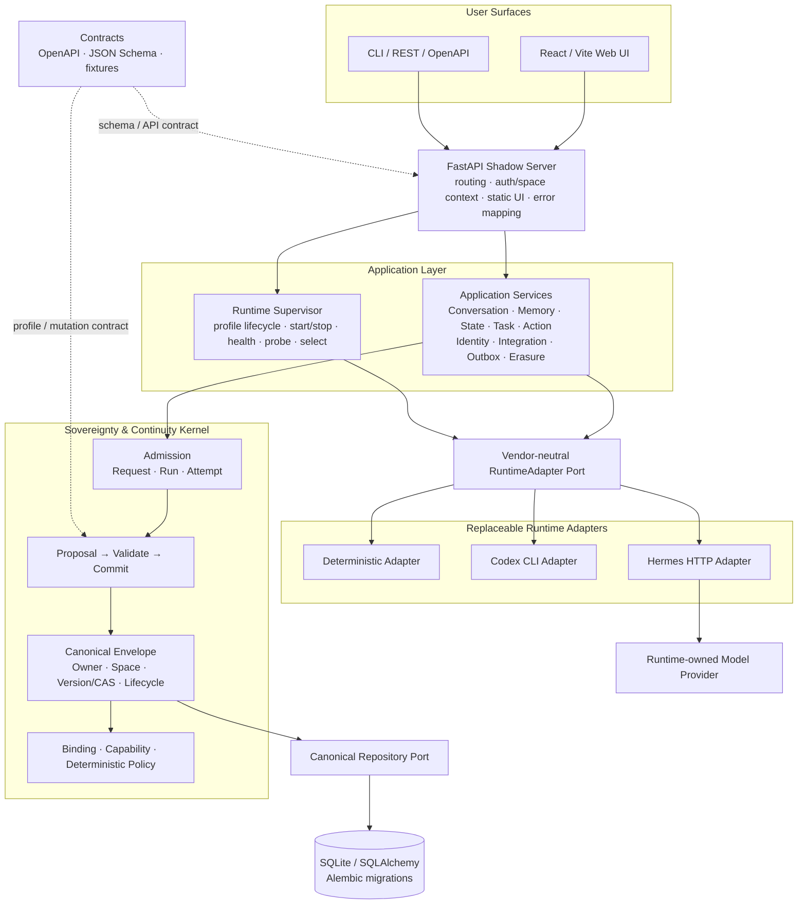
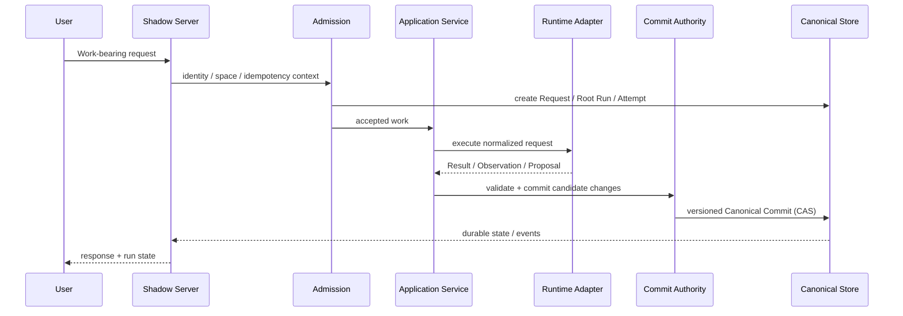

<h1 align="center">OpenShadow</h1>

<p align="center">
  <strong>让个人 AI 的身份、记忆、任务与治理能力，独立于模型和 Agent Runtime 长期存在。</strong>
</p>

<p align="center">
  <em>Replace the runtime. Keep the Shadow.</em>
</p>

<p align="center">
  
  
  
  
  
</p>

<p align="center">
  <strong>中文</strong> · <a href="README_EN.md">English</a> · <a href="docs/architecture.md">Architecture</a> · <a href="docs/roadmap.md">Roadmap</a> · <a href="docs/adr/README.md">ADR</a>
</p>

---

## OpenShadow 是什么？

OpenShadow 是一个 **local-first、vendor-neutral 的 Personal AI Continuity & Sovereignty Layer**。

它不试图重新实现一个更大的 Agent Framework，也不把某个模型、Agent Runtime、Memory Engine 或数据库永久绑定到用户身上。它解决的是另一个问题：

> **如果明天替换模型、Runtime、Memory Engine，甚至底层数据库，这个 AI 还能不能保持“还是同一个 Shadow”？**

OpenShadow 把真正需要长期存在的东西——身份、Space、Conversation、Memory、State、Task、Action、Skill/Integration 元数据、治理记录——保存在自己的 Canonical Store 中；快速变化的智能与执行能力通过 Adapter 接入。

```text
Runtime / Model / Memory Engine 可以替换
                 ↓
      ┌─────────────────────┐
      │     OpenShadow      │
      │ identity · memory   │
      │ task · state · run  │
      │ policy · ownership  │
      └──────────┬──────────┘
                 ↓
          User-owned Assets
```

一句话概括：

> **Runtime 负责“想和做”；OpenShadow 负责“我是谁、我拥有什么、什么修改算数、工作如何继续，以及数据如何迁移和删除”。**

---

## 为什么做这个项目？

今天的 AI 基础设施变化非常快：模型在换、Agent Runtime 在换、Memory 方案在换、Tool/Workflow 生态也在换。如果用户的长期资产直接依附在某个 Runtime 的私有 Session、Memory 或数据库里，组件一换，用户积累就很容易被一起带走。

OpenShadow 的设计目标是把 **长期稳定的用户主权层** 和 **快速变化的智能执行层** 分开。

| 常见问题 | OpenShadow 的处理方式 |
| --- | --- |
| 换 Runtime 就要重做上下文和状态 | Runtime 通过 vendor-neutral Adapter 接入，长期资产不属于 Runtime |
| Agent 可以直接把推测写成“事实” | 外部智能只能返回 Result / Observation / Proposal，最终 Canonical Commit 由 Shadow 决定 |
| Memory 被某个向量库或 Memory Engine 锁死 | Canonical Memory 独立保存；Embedding、Index、Graph、Rerank 都是可重建派生能力 |
| 长任务和 Runtime Session 绑定 | Shadow 自己维护 Request / Run / Attempt / Durable Task 连续性 |
| 用户很难迁移、纠正或彻底删除数据 | Stable ID、Version/CAS、Correction、Tombstone、Export、Erasure 都属于 Shadow 治理边界 |
| 为了“可扩展”把系统做成万能框架 | Tiny Kernel 只保留长期不可替代的控制语义，其余能力放在 typed Profile / Adapter 中 |

---

# 系统真实架构

> 下图只展示 **当前仓库已经存在的主要运行时组件与真实数据流**，不是未来愿景图。



### 这张图最重要的三件事

1. **OpenShadow 是模块化单体，不是微服务集合。** Kernel、Application、FastAPI 组合根在同一参考部署中；只有部分 Runtime / Provider 通过进程或 HTTP 边界外置。
2. **Runtime 不能直接写 Canonical Store。** Runtime 只通过通用 Port 返回结果或 Proposal，长期状态最终仍经过 Shadow 的 Authority / CAS / lifecycle。
3. **模型 Provider 不属于 Shadow 核心。** Codex 自己管理登录与 Provider；Hermes 也在自己的 Runtime 边界内连接模型。Shadow 不直接绑定某个模型厂商。

---

## 一次请求是怎么跑的？



对于 Conversation turn，核心路径可以压缩成：

```text
HTTP Request
   → Admission
   → ConversationService
   → selected RuntimeAdapter
   → Result / Proposal
   → CommitAuthority + CAS
   → Canonical Store
```

这也是 OpenShadow 的核心不变量：

> **External intelligence may propose. Only Shadow commits.**

---

# 当前实现到什么程度？

当前 `main` 已覆盖 **Phase 0–4 的 reference implementation + Phase 5 Core Slice**。下面按“用户真正能从代码得到什么”来列，而不是按设计文档章节堆概念。

| 能力域 | 状态 | 当前实现 |
| --- | :---: | --- |
| Tiny Kernel | ✅ | Stable ID、Owner/Space、Canonical Envelope、Version/CAS、Admission、Request/Run/Attempt、Binding、Capability、Commit Authority |
| Conversation Loop | ✅ | Conversation / Message、Runtime dispatch、Run events、retry、幂等重放、Store unavailable 路径、Web UI |
| Memory | ✅ | Candidate → Commit、correction、merge contract、logical delete、physical erase、Recall/Maintenance Adapter、source invalidation、derived index rebuild |
| Skill / Integration | ✅ | Agent Skills-compatible SkillAsset sidecar、digest/pinned revision、Integration Profile、external asset governance |
| State | ✅ | Observation / StateProposal、typed state、evidence、TTL、fresh / stale / unknown、source unavailable |
| Durable Continuity | ✅ | Durable Task、Checkpoint/Handoff、Schedule/Clock、restart recovery、Migration/Integrity boundary |
| Action & Side Effects | ✅ | Action Proposal、approval、pending-before-call、idempotency、success/failure/unknown、reconciliation |
| Reliability | ✅ | Durable Outbox、unknown outcome semantics、restricted commit behavior、runtime lifecycle control |
| Router / Policy / Pulse | ✅ | Binding Proposal、deterministic policy checks、Router/Policy slice、Semantic Pulse proposal path |
| Identity / Multi-endpoint Core | ✅ | Endpoint pairing、Space membership、Invitation、owner/editor/viewer 读 ACL、Web context |
| Runtime Management | ✅ | Deterministic、Codex CLI、Hermes profiles；start/stop/restart/health/probe/select；Management UI |
| Portability / Erasure | ✅ | Portable export/import contract、restore boundary、Tombstone、cross-component erasure metadata、backup metadata |
| Operations Baseline | ✅ | health/readiness、low-cardinality metrics、redaction/config validation、Docker/Compose、release-check |

### 当前仍依赖真实部署环境验证的部分

这些能力已经有边界、代码或参考实现，但 **不能因为本地测试通过就宣称已经完成生产部署验证**：

| 范围 | 当前真实状态 |
| --- | --- |
| OIDC | Auth / verifier / session / secret 边界已实现；真实 IdP/Vendor 联调仍需目标环境验证 |
| PostgreSQL | Store profile 与显式 PostgreSQL boundary 已实现；真实连接、迁移、故障恢复需要部署环境验收 |
| Hermes / Codex Provider | Adapter 已实现；真实 Provider、Session/resume、长时间运行故障演练不是默认测试前置 |
| Backup / Restore | Portable restore、metadata 和边界已存在；真实加密备份介质/云备份不属于当前本地基线 |
| Voice / Device | 通用 Peripheral Contract、consent/capability/expiry 边界已实现；真实语音、硬件和 Vendor SDK 尚未产品化 |
| Multi-user / Sync | Phase 5 Core Slice 已完成；完整多用户发行、remote Store、跨设备同步仍是后续能力 |
| Production validation | 压测、混沌、真实依赖扫描、目标环境安全演练仍属于发布前置 |

### Phase 交付概览

```text
Phase 0  Kernel Foundation              ✅
Phase 1  Personal Shadow Loop           ✅
Phase 2  Memory & Capability Profiles   ✅
Phase 3  Continuity & State             ✅
Phase 4  Action & Proactivity            ✅
Phase 5  Multi-endpoint / Multi-user    ✅ Core Slice  ·  ⏳ Full rollout
```

详细状态以 [`docs/roadmap.md`](docs/roadmap.md) 和各 `phase*-status.md` / `production-*-status.md` 为准。

---

# 核心设计原则

## 1. 用户资产属于 Shadow，不属于某个组件

Canonical Store 保存的是用户长期拥有的资产和治理状态，不保存 Provider Secret、Runtime 私有 Memory、缓存或可以重建的 Index。

```text
User-owned
├─ Conversations
├─ Canonical Memories
├─ State
├─ Durable Tasks
├─ Action History
├─ Skill / Integration metadata
└─ Ownership / Policy / Binding records

Replaceable / Derived
├─ Runtime session
├─ Model provider state
├─ Embedding / Vector index
├─ Memory ranking cache
├─ Runtime projection
└─ Vendor-private state
```

## 2. Tiny Kernel 保持小而稳定

Kernel 只理解那些即使未来 AI 范式变化仍然必须由 Shadow 自己掌握的东西：

- Identity / Ownership / Space
- Canonical Record / Lifecycle
- Proposal / Validate / Commit
- Work Admission
- Request / Run / Attempt
- Binding / Capability
- Deterministic enforcement
- Portability / Erasure intent

Memory、State、Task、Action、Skill 等业务语义通过 **versioned typed Profile** 演进，而不是不断把 Kernel 膨胀成一个万能对象系统。

## 3. 不重造整个 AI 基础设施

OpenShadow **明确不自研**：基础模型、通用 Agent Loop、向量数据库、Memory Intelligence、知识图谱、Workflow Engine、通用脚本沙箱、语音引擎、Coding Agent、浏览器 Agent 或设备协议栈。

这些能力应该通过 Adapter / Profile / Capability Contract 组合已有优秀项目。

## 4. Vendor Isolation

除了具体 Adapter、它自己的测试和部署配置之外，Kernel、Application、公共 Schema、OpenAPI 和 Web UI 不应该出现针对 Codex、Hermes 或其他 Vendor 的业务分支。

新增 Runtime 的理想路径是：

```text
New Runtime
   ↓
AdapterDescriptor + Capability
   ↓
RuntimeAdapter Port
   ↓
OpenShadow
```

而不是修改 Core 主流程。

---

# Runtime 与可替换组件

默认 Runtime profile 位于 [`config/runtime-profiles.json`](config/runtime-profiles.json)。

| Runtime | 默认状态 | 用途 |
| --- | --- | --- |
| `deterministic` | active / auto-start | 无外部模型、无副作用；作为开发、测试和验收基线 |
| `codex` | enabled / on-demand | 通过 `codex exec --json` 调用已安装的 Codex CLI；登录与 Provider 由 Codex 自己管理 |
| `hermes` | disabled | 通过 HTTP Adapter 接入 Hermes；需要本机填写真实 launch / health / Provider 配置 |

Runtime 基础 Port 保持很小：

```text
describe()
execute(execution_request)
events(execution_ref)
```

`cancel`、`checkpoint`、`native_resume`、`semantic_handoff`、`progress`、`usage`、`reconciliation` 等能力通过 Capability Negotiation 声明，Adapter 不允许伪造自己不支持的能力。

---

# 快速开始

当前参考部署：**Windows + Python 3.12+ + SQLite + local Web UI**。Node.js/npm 只用于构建 Web UI；Codex CLI 和 Hermes 都是可选 Runtime，不是启动 OpenShadow 的前置条件。

```powershell
git clone https://github.com/wzw57/OpenShadow.git
Set-Location OpenShadow

py -3.12 -m venv .venv
.\.venv\Scripts\Activate.ps1
python -m pip install --upgrade pip
python -m pip install -e ".[dev]"

New-Item -ItemType Directory -Force .shadow | Out-Null
alembic upgrade head

powershell -NoProfile -ExecutionPolicy Bypass `
  -File .\scripts\start-shadow-management.ps1 -Build -OpenBrowser
```

启动后：

| 入口 | 地址 |
| --- | --- |
| Web UI | `http://127.0.0.1:8765/ui/` |
| FastAPI Docs | `http://127.0.0.1:8765/docs` |
| Health | `http://127.0.0.1:8765/healthz` |
| Readiness | `http://127.0.0.1:8765/readyz` |
| OpenAPI | `http://127.0.0.1:8765/openapi.json` |

使用本机已安装的 Codex CLI：

```powershell
powershell -NoProfile -ExecutionPolicy Bypass `
  -File .\scripts\start-shadow-management.ps1 `
  -Build -RuntimeId codex -AutoStartRuntime -OpenBrowser
```

默认数据文件为 `.shadow/shadow.db`，不会提交到 Git。

---

# 项目结构

```text
OpenShadow/
├─ packages/
│  ├─ shadow-kernel/          # Admission / Commit / Envelope / CAS / Capability
│  └─ shadow-application/     # Conversation / Memory / State / Task / Action / Identity ...
│
├─ adapters/
│  ├─ store-sqlite/           # SQLite Canonical Repository
│  ├─ test-deterministic/     # deterministic Runtime baseline
│  ├─ codex-agent/            # Codex CLI Adapter
│  └─ hermes-agent/           # Hermes HTTP Adapter
│
├─ apps/
│  ├─ shadow-server/          # FastAPI composition root / OpenAPI / static UI
│  └─ shadow-web/             # React / TypeScript / Vite Web UI
│
├─ contracts/                 # JSON Schema / OpenAPI / fixtures / manifests
├─ config/                    # Runtime profiles and non-secret config
├─ migrations/                # Alembic migrations
├─ docs/                      # Architecture / ADR / design gates / delivery status
├─ scripts/                   # Startup / release / management scripts
└─ tests/                     # Contract / Service / Repository / API / failure / UI tests
```

---

# 技术栈

| 层 | 技术 |
| --- | --- |
| Backend | Python `>=3.12` |
| API | FastAPI + Uvicorn |
| Models / Validation | Pydantic 2 + Python typing + JSON Schema |
| Persistence | SQLAlchemy 2 + SQLite |
| Migration | Alembic |
| Web | React 19 + TypeScript 5.7 + Vite 6 |
| Contract | OpenAPI 3.1 + checked-in JSON Schema + fixtures |
| Testing | pytest + pytest-asyncio + httpx |
| Quality | Ruff |
| Runtime | Deterministic / Codex CLI / Hermes Adapter |
| Deployment baseline | local process + Docker / Compose reference |

---

# 工程与验收

OpenShadow 把 **代码、Contract、测试和文档同步** 当作工程约束，而不是事后补文档。公共 API、Canonical 生命周期、Profile Schema、Phase 状态发生变化时，对应实现和测试需要一起更新。

常用检查：

```powershell
ruff check packages/shadow-kernel/src packages/shadow-application/src `
  adapters/test-deterministic/src adapters/store-sqlite/src `
  adapters/hermes-agent/src adapters/codex-agent/src `
  apps/shadow-server migrations tests

pytest -q

$env:SHADOW_DATABASE_URL = "sqlite://"
alembic upgrade head
alembic downgrade base
Remove-Item Env:SHADOW_DATABASE_URL

Push-Location apps/shadow-web
npm install
npm run build
Pop-Location
```

发布前还可以运行：

```powershell
./scripts/release-check.ps1
```

当前验收基线覆盖 Contract / Repository / API、幂等重放、Store unavailable、restart recovery、Runtime lifecycle、Web UI smoke、migration upgrade/downgrade，以及 production baseline 的 telemetry/config/redaction 等路径。

---

# 文档导航

README 只负责回答“这是什么、怎么运行、现在做到哪”。完整设计细节放在 `docs/`：

| 文档 | 作用 |
| --- | --- |
| [`docs/architecture.md`](docs/architecture.md) | 系统定义、完整逻辑架构、Kernel / Profile / Adapter 边界 |
| [`docs/technical-architecture.md`](docs/technical-architecture.md) | 详细技术架构与运行边界 |
| [`docs/domain-model.md`](docs/domain-model.md) | Canonical domain model |
| [`docs/implementation-stages.md`](docs/implementation-stages.md) | Phase 0–5 的实现顺序与退出条件 |
| [`docs/roadmap.md`](docs/roadmap.md) | 当前 `main` 的真实交付状态 |
| [`docs/contract-baseline.md`](docs/contract-baseline.md) | JSON Schema / OpenAPI / Contract baseline |
| [`docs/adr/README.md`](docs/adr/README.md) | Architecture Decision Records |
| [`docs/documentation-sync.md`](docs/documentation-sync.md) | 文档漂移与 source-of-truth 规则 |

更细的 Phase、Runtime、Web UI、Production Readiness 状态请直接查看 [`docs/`](docs/) 下对应 `*-status.md`。

---

# 项目边界

OpenShadow 当前首先是一个 **local-first reference implementation**，而不是已经完成所有真实生产环境验证的 SaaS 产品。

它已经证明的核心命题是：

- 可以把长期用户资产和 Runtime / Model 解耦；
- 可以通过统一 Authority 管住 Canonical change；
- 可以在不把 Kernel 做成万能框架的前提下扩展 Memory / State / Task / Action；
- 可以替换 Runtime 而不改变 Shadow 的稳定身份、Run/Task 和长期资产模型；
- 可以把迁移、删除、版本、来源和副作用治理放回用户自己的长期控制层。

下一阶段真正有价值的工作，不是继续堆抽象，而是用真实部署、真实用户和长期运行数据去验证这些边界。

---

<p align="center">
  <strong>OpenShadow</strong><br/>
  A personal AI should outlive its runtime.
</p>
