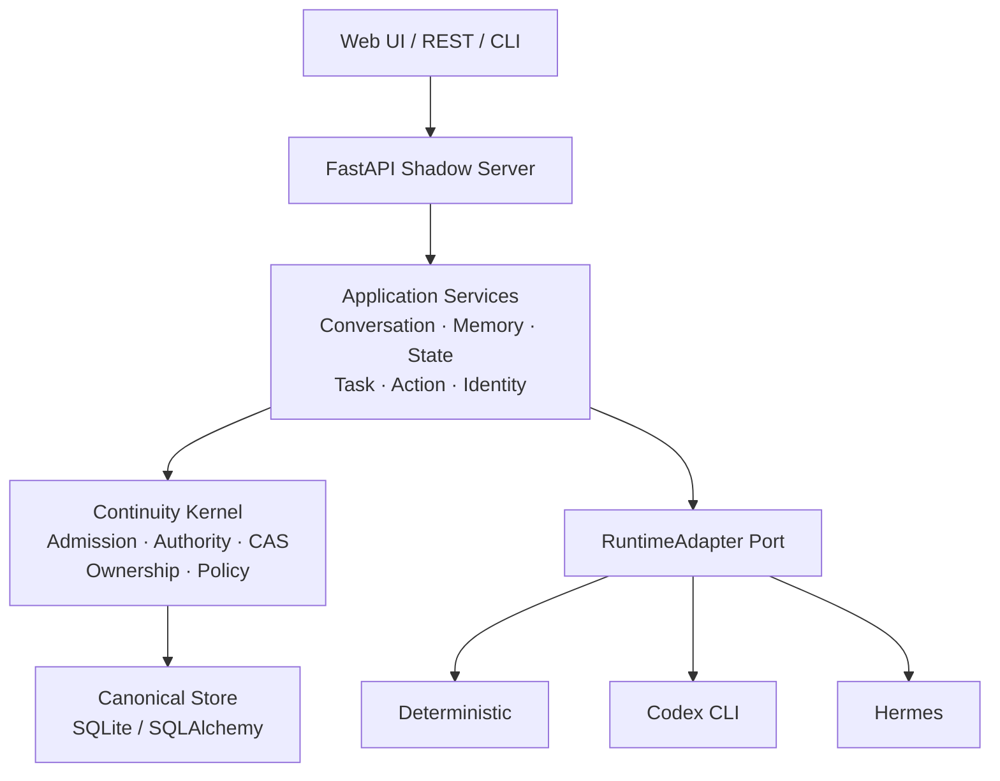

<h1 align="center">OpenShadow</h1>

<p align="center">
  <strong>A continuity layer for personal AI.</strong><br/>
  让 AI 的身份、记忆、任务与长期资产独立于模型和 Agent Runtime。
</p>

<p align="center">
  <em>Replace the runtime. Keep the Shadow.</em>
</p>

<p align="center">
  
  
  
  
  
</p>

<p align="center">
  <strong>中文</strong> · <a href="README_EN.md">English</a> ·
  <a href="docs/architecture.md">Architecture</a> ·
  <a href="docs/roadmap.md">Roadmap</a> ·
  <a href="docs/adr/README.md">ADR</a>
</p>

---

## What is OpenShadow?

OpenShadow 是一个 **local-first、vendor-neutral 的 Personal AI Continuity Layer**。

它不重新实现 Agent Framework，而是把真正需要长期存在的用户资产从 Runtime 中抽离出来：

- Identity / Space
- Conversation / Memory / State
- Durable Task / Action
- Skill / Integration metadata
- Ownership / Policy / Governance

模型、Agent Runtime、Memory Engine 和底层存储可以替换，而 Shadow 的长期身份与资产保持连续。

```text
    Model / Runtime / Memory Engine
              replaceable
                   │
                   ▼
        ┌────────────────────┐
        │     OpenShadow     │
        │                    │
        │ identity · memory  │
        │ state · task · run │
        │ policy · ownership │
        └─────────┬──────────┘
                  │
                  ▼
          User-owned Assets
```

> **Runtime 负责思考和执行；OpenShadow 负责长期身份、资产、连续性和治理。**

---

## Why OpenShadow?

AI Stack 变化很快：模型会换，Runtime 会换，Memory 方案会换，Agent Framework 也会换。

如果长期状态直接绑定在某个 Runtime 的私有 Session 或数据库里，更换组件往往意味着重新建立上下文。OpenShadow 把 **长期稳定的用户主权层** 和 **快速变化的智能执行层** 分开。

核心规则只有一个：

> **External intelligence may propose. Only Shadow commits.**

Runtime 可以产生 Result、Observation 或 Proposal，但不能绕过 Shadow 直接修改长期 Canonical State。

---

## Architecture



OpenShadow 当前采用 **模块化单体**：

- Kernel 管长期不变量和 Canonical Commit
- Application 管 Conversation / Memory / State / Task / Action
- Runtime Adapter 提供可替换的智能执行能力
- Canonical Store 保存用户长期资产
- Vendor-specific 逻辑隔离在 Adapter 中

详细设计见 [`docs/architecture.md`](docs/architecture.md)。

---

## Current Status

当前 `main` 已实现 **Phase 0–4**，并完成 **Phase 5 Core Slice**。

| Capability | Status |
| --- | :---: |
| Identity / Space / Ownership | ✅ |
| Conversation & Runtime Dispatch | ✅ |
| Canonical Memory | ✅ |
| State & Observation | ✅ |
| Durable Task / Checkpoint / Recovery | ✅ |
| Action Proposal & Approval | ✅ |
| Runtime Adapter & Capability Negotiation | ✅ |
| Codex CLI Adapter | ✅ |
| Hermes HTTP Adapter | ✅ |
| Skill / Integration Metadata | ✅ |
| Router / Policy | ✅ |
| Export / Import / Erasure | ✅ |
| Multi-endpoint / Multi-user Core | ✅ |
| Web Management UI | ✅ |
| Docker / Metrics / Health / Readiness | ✅ |

仍需要真实部署环境进一步验证：

- OIDC / external IdP
- PostgreSQL production deployment
- Hermes / Codex 长时间运行
- Backup / Restore
- Multi-device Sync
- Production load / chaos / security testing

完整进度见 [`docs/roadmap.md`](docs/roadmap.md)。

---

## Runtime Support

Runtime 通过统一 `RuntimeAdapter` 接入。

| Runtime | Purpose |
| --- | --- |
| `deterministic` | 无模型依赖的开发 / 测试基线 |
| `codex` | Codex CLI Runtime |
| `hermes` | Hermes HTTP Runtime |

基础 Runtime Port：

```text
describe()
execute()
events()
```

其余能力通过 Capability Negotiation 声明，例如 `cancel`、`checkpoint`、`native_resume`、`semantic_handoff`、`progress`、`usage` 和 `reconciliation`。

因此增加新的 Runtime 不需要修改 OpenShadow Core。

---

## Quick Start

当前参考环境：**Windows + Python 3.12+ + SQLite**。

```powershell
git clone https://github.com/wzw57/OpenShadow.git
Set-Location OpenShadow

py -3.12 -m venv .venv
.\.venv\Scripts\Activate.ps1
python -m pip install -e ".[dev]"

New-Item -ItemType Directory -Force .shadow | Out-Null
alembic upgrade head

powershell -NoProfile -ExecutionPolicy Bypass `
  -File .\scripts\start-shadow-management.ps1 `
  -Build -OpenBrowser
```

启动后：

| Service | URL |
| --- | --- |
| Web UI | `http://127.0.0.1:8765/ui/` |
| API Docs | `http://127.0.0.1:8765/docs` |
| Health | `http://127.0.0.1:8765/healthz` |
| Readiness | `http://127.0.0.1:8765/readyz` |

### Use Codex Runtime

```powershell
powershell -NoProfile -ExecutionPolicy Bypass `
  -File .\scripts\start-shadow-management.ps1 `
  -Build -RuntimeId codex -AutoStartRuntime -OpenBrowser
```

默认数据保存在 `.shadow/shadow.db`。

---

## Repository

```text
OpenShadow/
├─ packages/
│  ├─ shadow-kernel/
│  └─ shadow-application/
│
├─ adapters/
│  ├─ store-sqlite/
│  ├─ test-deterministic/
│  ├─ codex-agent/
│  └─ hermes-agent/
│
├─ apps/
│  ├─ shadow-server/
│  └─ shadow-web/
│
├─ contracts/
├─ config/
├─ migrations/
├─ docs/
├─ scripts/
└─ tests/
```

---

## Tech Stack

| Layer | Stack |
| --- | --- |
| Backend | Python 3.12+ |
| API | FastAPI |
| Validation | Pydantic 2 / JSON Schema |
| Persistence | SQLAlchemy 2 / SQLite |
| Migration | Alembic |
| Web | React 19 / TypeScript / Vite |
| Contract | OpenAPI 3.1 |
| Testing | pytest / httpx |
| Quality | Ruff |

---

## Design Principles

**User-owned assets > Runtime-owned state**  
长期资产属于用户，而不是模型、Runtime 或 Memory Engine。

**Canonical state is authoritative**  
外部智能可以提出修改，但最终 Commit 必须经过 Shadow。

**Keep the kernel small**  
Kernel 只保存 Identity、Ownership、Lifecycle、Admission、Authority、Capability 等长期稳定语义。

**Vendor isolation**  
Vendor-specific 行为只能存在于 Adapter 边界。

---

## Documentation

| Document | Description |
| --- | --- |
| [`architecture.md`](docs/architecture.md) | 系统架构与核心边界 |
| [`technical-architecture.md`](docs/technical-architecture.md) | 技术架构 |
| [`domain-model.md`](docs/domain-model.md) | Canonical Domain Model |
| [`roadmap.md`](docs/roadmap.md) | 当前实现状态 |
| [`implementation-stages.md`](docs/implementation-stages.md) | Phase 0–5 |
| [`contract-baseline.md`](docs/contract-baseline.md) | API / Schema Contract |
| [`adr/`](docs/adr/README.md) | Architecture Decision Records |

---

## Project Scope

OpenShadow 当前是一个 **local-first reference implementation**，而不是完整的生产级 Personal AI 产品。

它重点验证的是：

> **AI 的长期身份和用户资产，可以独立于任何特定模型、Runtime 或 Memory Engine 存在。**

下一阶段重点将从继续增加抽象，转向真实 Runtime、真实部署和长期运行验证。

---

<p align="center">
  <strong>OpenShadow</strong><br/>
  <em>A personal AI should outlive its runtime.</em>
</p>
