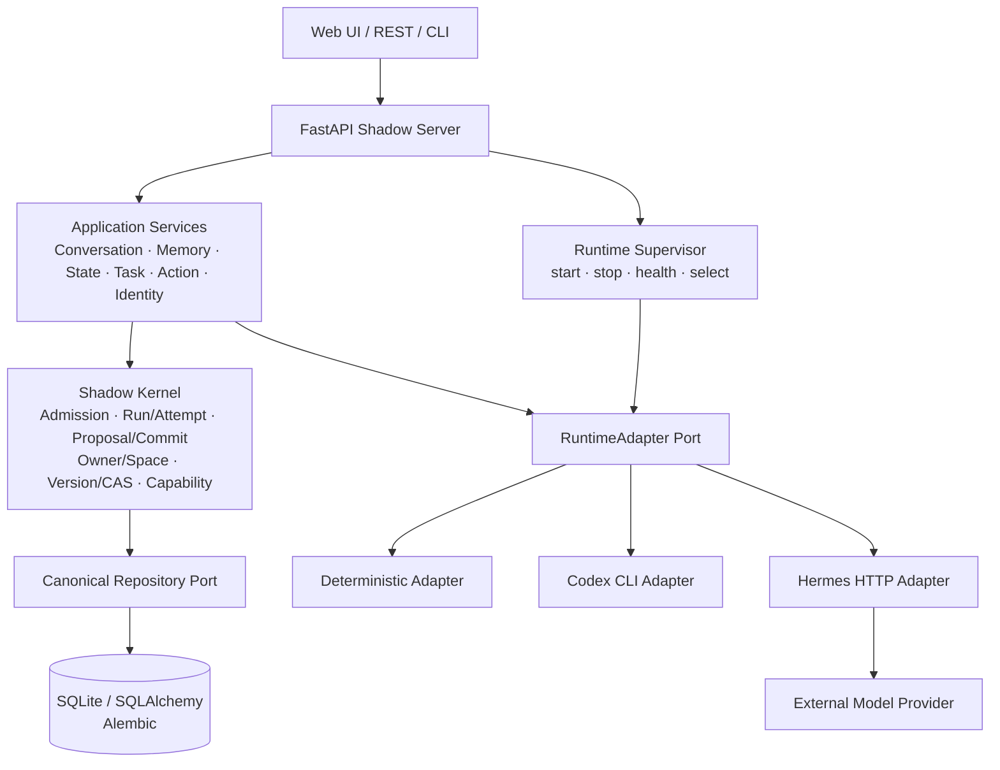

<h1 align="center">OpenShadow</h1>

<p align="center">
  <strong>让个人 AI 的长期身份、记忆、任务和状态，不再绑定某一个模型或 Agent Runtime。</strong>
</p>

<p align="center"><em>Replace the runtime. Keep the Shadow.</em></p>

<p align="center">
  
  
  
  
</p>

<p align="center">
  <strong>中文</strong> · <a href="README_EN.md">English</a> · <a href="docs/architecture.md">Architecture</a> · <a href="docs/roadmap.md">Roadmap</a> · <a href="docs/adr/README.md">ADR</a>
</p>

---

## OpenShadow 是什么？

OpenShadow 是一个 **local-first、vendor-neutral 的 Personal AI Continuity Layer**。

它不是新的 Agent Framework，也不重新实现模型、Agent Loop、Memory Engine 或 Workflow Engine。

它解决的是一个更长期的问题：

> **当模型、Runtime、Memory 方案不断更换时，如何让用户始终拥有“同一个 AI”？**

OpenShadow 把需要长期存在的资产——身份、Conversation、Memory、State、Task、Action、Skill/Integration 元数据和治理记录——保存为自己的 Canonical State；快速变化的智能与执行能力通过 Adapter 接入。

```text
Model / Runtime / Memory Engine   ← 可替换
              │
              ▼
        ┌──────────────┐
        │  OpenShadow  │
        │ identity     │
        │ memory       │
        │ state/task   │
        │ run/policy   │
        └──────┬───────┘
               ▼
        User-owned Assets          ← 长期存在
```

**Runtime 负责“想和做”；OpenShadow 负责“我是谁、我拥有什么、什么修改算数，以及工作如何继续”。**

---

## 为什么做这个项目？

今天的 Agent 生态变化很快，但用户的长期资产不应该跟着某个 Runtime 一起消失。

OpenShadow 尝试把两类东西分开：

| 稳定层 | 快速变化层 |
| --- | --- |
| Identity / Ownership | Model |
| Conversation / Memory | Agent Runtime |
| State / Durable Task | Memory Intelligence |
| Run / Attempt | Router / Workflow |
| Version / Lifecycle | Provider / Tool |
| Export / Erasure | Database / Index implementation |

核心原则只有三个：

1. **用户资产不属于 Runtime。**
2. **外部智能可以 Proposal，但只有 Shadow 能 Commit Canonical State。**
3. **组件可以替换，Stable ID、历史与连续性不能丢。**

---

# 当前真实架构

> 下图只画当前仓库已经存在的主要组件和运行路径，不是未来愿景图。



一次普通请求的主路径：

```text
Request
  → Admission
  → Application Service
  → selected Runtime Adapter
  → Result / Proposal
  → Commit Authority + CAS
  → Canonical Store
```

这意味着 **Codex、Hermes 或未来 Runtime 都不能直接修改 Shadow 的长期资产**。

---

## 当前实现

当前 `main` 已覆盖 **Phase 0–4 reference implementation + Phase 5 Core Slice**。

| 能力 | 状态 | 当前范围 |
| --- | :---: | --- |
| Kernel & Continuity | ✅ | Identity、Owner/Space、Canonical Envelope、Version/CAS、Admission、Request/Run/Attempt、Binding/Capability |
| Conversation & Memory | ✅ | Conversation/Message、Memory candidate/commit、correction、delete/erase、recall/maintenance、derived index rebuild |
| State & Durable Task | ✅ | Observation/StateProposal、fresh/stale/unknown、Task、Checkpoint/Handoff、Schedule/Clock、restart recovery |
| Action & Proactivity | ✅ | Action approval、idempotency、unknown outcome、reconciliation、Outbox、Router/Policy、Semantic Pulse |
| Skill & Integration | ✅ | Agent Skills-compatible SkillAsset、Integration Profile、external asset governance |
| Runtime | ✅ | Deterministic、Codex CLI、Hermes Adapter；Runtime lifecycle / health / select |
| Product Surface | ✅ | React/Vite Web UI、FastAPI/OpenAPI、management UI、health/readiness、metrics、Docker/Compose |
| Phase 5 Core | ✅ | Endpoint pairing、Space membership/invitation、基础 ACL 与 Web context |

### 仍未完成生产级验证

真实 **OIDC、PostgreSQL、Provider 长时间运行、Voice/Device、跨设备同步、完整多用户发行、压测/混沌/安全演练** 仍需要真实部署环境或后续实现。

所以当前定位是：**完整的 reference implementation，而不是已经完成生产验证的 Personal AI 产品。**

---

## Quick Start

当前默认参考部署：Windows + Python 3.12 + SQLite + 本地 Web UI。

```powershell
git clone https://github.com/wzw57/OpenShadow.git
Set-Location OpenShadow

py -3.12 -m venv .venv
.\.venv\Scripts\Activate.ps1
python -m pip install -e ".[dev]"

New-Item -ItemType Directory -Force .shadow | Out-Null
alembic upgrade head

powershell -NoProfile -ExecutionPolicy Bypass `
  -File .\scripts\start-shadow-management.ps1 -Build -OpenBrowser
```

启动后：

- Web UI: `http://127.0.0.1:8765/ui/`
- API Docs: `http://127.0.0.1:8765/docs`
- Health: `http://127.0.0.1:8765/healthz`

使用已安装的 Codex CLI：

```powershell
powershell -NoProfile -ExecutionPolicy Bypass `
  -File .\scripts\start-shadow-management.ps1 `
  -Build -RuntimeId codex -AutoStartRuntime -OpenBrowser
```

---

## 项目结构

```text
packages/shadow-kernel/        核心治理与连续性原语
packages/shadow-application/   Conversation / Memory / State / Task / Action 等服务
adapters/                      Store / Deterministic / Codex / Hermes Adapter
apps/shadow-server/            FastAPI 组合根
apps/shadow-web/               React / Vite Web UI
contracts/                     OpenAPI / JSON Schema / fixtures
migrations/                    Alembic migrations
docs/                          架构、ADR、Phase 状态与设计闸门
tests/                         Contract / Service / Repository / API / failure tests
```

技术栈：**Python 3.12 · FastAPI · Pydantic 2 · SQLAlchemy 2 · SQLite/PostgreSQL profile · Alembic · React 19 · TypeScript · Vite · pytest · Ruff**

---

## 设计边界

OpenShadow **不自研**基础模型、通用 Agent Loop、Memory Intelligence、向量数据库、Workflow Engine、Coding Agent、浏览器 Agent、语音引擎或设备协议栈。

它只尝试稳定这些长期边界：

```text
Identity / Ownership
Canonical State / Version
Proposal / Validate / Commit
Admission / Run / Attempt
Binding / Capability
Portability / Erasure
```

其他能力应尽量通过 **Profile / Adapter / Capability Contract** 接入，而不是继续膨胀 Kernel。

---

## 文档

深入设计不再堆在 README：

- [Architecture](docs/architecture.md) — 完整逻辑架构与边界
- [Roadmap](docs/roadmap.md) — 当前实现状态与阶段路线
- [Implementation Stages](docs/implementation-stages.md) — Phase 0–5
- [Domain Model](docs/domain-model.md) — Canonical / Profile / Run 等领域模型
- [ADR](docs/adr/README.md) — 架构决策记录
- [OpenAPI](contracts/openapi/openapi.yaml) — 公共 API Contract

---

<p align="center">
  <strong>Replace the runtime. Keep the Shadow.</strong>
</p>
