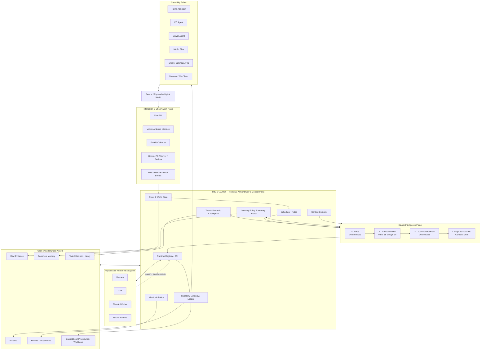

# OpenShadow

OpenShadow 是一个 **Local-first、Runtime-neutral** 的个人 AI 连续性与控制层。

它不试图成为另一个“全能 Agent”。Shadow 负责长期持有用户的 **Memory、Task、Capability、Policy 与 History / World State**，而 Hermes、DeepSeek Harness、Claude / Codex 以及未来 Agent Runtime 只负责推理和执行。

> **Shadow owns the continuity.**  
> Runtime owns reasoning and execution — never durable user state.

## Why OpenShadow

今天的个人 AI 状态通常被锁在具体 Agent / Session / Framework 内：更换 Runtime 往往意味着重新迁移记忆、任务、工具、配置和上下文。模型越来越强，但用户与 AI 的长期关系却仍然很脆弱——一次换模型、换框架、换设备或服务停止维护，就可能意味着大量上下文重新开始。

OpenShadow 想解决的不是“模型还不够聪明”，而是一个更长期的问题：

> **如果未来十年模型、Agent Framework 和 AI 产品不断换代，什么东西应该一直留下来？**

我们的答案是：**用户本身，以及围绕这个用户持续积累的长期状态。**

这包括：

- 用户是谁、重视什么、有哪些长期约束；
- 正在做什么、已经做到了哪里；
- 曾经做过哪些决定、为什么这么决定；
- 已经建立了哪些能力、自动化与工作流；
- 当前数字世界和物理世界处于什么状态；
- 哪些 Agent 被允许读取什么、执行什么；
- 过去的经验如何影响下一次行动。

这些东西不应该属于某一代模型，也不应该随着某个 Agent Runtime 的消失而消失。

同时，OpenShadow 不希望为了“常驻 AI”而持续运行一个昂贵的大模型 Agent。系统采用**分层智能与按需升级**：普通代码和规则先处理确定性事件，极小本地模型 Pulse 负责 7×24 注意力判断，更大的本地模型和 Agent Runtime 只在真正需要时被唤醒。

## Design vision

### 1. AI should accumulate, not reset

今天很多 AI 产品的使用体验，本质上仍然是一次次“临时会话”。即使加入 Memory，长期状态往往也依附于某个具体产品。

OpenShadow 希望把个人 AI 从：

```text
Use an Agent
    ↓
Generate some context
    ↓
Agent / product changes
    ↓
Start again
```

变成：

```text
                    Personal Continuity
                           │
             ┌─────────────┼─────────────┐
             ▼             ▼             ▼
          Runtime A     Runtime B     Runtime C
             │             │             │
             └────── continuously contribute ──────┘
                           │
                           ▼
               Memory / Tasks / Skills /
              Capabilities / History grow
```

模型和 Agent 可以像应用程序一样不断更换，但用户的数字连续性应该不断积累，而不是不断清零。

### 2. The user should own the durable state

未来最有价值的 AI 资产未必是某一个模型，而可能是长期形成的：

```text
Personal Raw Evidence
        ↓
Canonical Memory
        ↓
Task / Decision History
        ↓
Capabilities / Workflows
        ↓
Personal Policies
        ↓
Experience / Attention / Preference Models
```

这些资产共同描述了一个人的数字环境、经验、行为边界以及已经建立起来的执行能力。

OpenShadow 希望这些资产具备三个属性：

- **User-owned** — 属于用户，而不是供应商或 Runtime；
- **Portable** — 可以被未来的新模型、新 Agent 继续使用；
- **Auditable** — 能知道一条状态从哪里来、为什么存在、什么时候被使用或修改。

从这个角度看，Shadow 沉淀的不是“聊天记录”，而是一套逐渐增长的**个人数字生产资料**。

### 3. The Agent is replaceable; the person is not

OpenShadow 的核心架构判断非常简单：

> **Agent 是耗材，个人连续性不是。**

今天可以使用 Hermes，明天可以切换到 DSH，复杂代码任务可以交给 Claude / Codex，未来出现新的强 Runtime 也可以接入。

```text
Hermes wins      → use Hermes
DSH becomes best → use DSH
New runtime wins → add an adapter
```

真正不应该随着这些变化一起迁移的是：

```text
Identity
Memory
Task
Capability
Policy
History / World State
```

因此 OpenShadow 的目标不是预测“最终哪个 Agent 会赢”，而是让**无论谁赢，用户都能直接使用它，同时保留过去所有积累。**

### 4. Personal AI should exist even when nobody is chatting with it

真正长期存在的个人 AI 不应该只在打开聊天框时存在。

Shadow 需要持续面对一个不断变化的世界：

```text
Email arrives
Calendar changes
Server degrades
Home state changes
Task deadline approaches
File changes
User moves between modes
```

因此系统必须具有自己的事件、状态、调度和注意力机制。

```text
World keeps changing
        ↓
Event / World State
        ↓
L0 Rules
        ↓
Shadow Pulse
        ↓
worth attention?
    ├─ no  → keep observing
    └─ yes → Task / Runtime / Capability
```

这意味着即使删除 Chat UI，Shadow 仍然应该能够继续“活着”。

### 5. Intelligence should be elastic

7×24 运行并不意味着 7×24 运行最昂贵的模型。

OpenShadow 希望把智能看作一种可以逐级投入的计算资源：

```text
L0  Deterministic Rules
        ↓
L1  Shadow Pulse
    tiny local model
        ↓
L2  Local General Brain
        ↓
L3  Runtime / Specialist
```

大多数事件应该在最便宜的一层结束，只有真正复杂、重要或不确定的问题才逐级升级。

这使“持续存在的个人 AI”在工程上可以真正长期运行，而不是依赖持续烧 Token 的 heartbeat。

### 6. AI capability should become infrastructure

很多个人 AI 项目最终都会变成一次性脚本：

```text
做一个邮箱 Agent
做一个家庭 Agent
做一个服务器 Agent
做一个论文 Agent
```

每个项目重新接鉴权、工具、权限、状态和上下文。

OpenShadow 希望把这些能力逐渐沉淀为统一 Capability：

```text
calendar.search
calendar.create
email.search
email.send
server.logs
server.restart
home.light.set
nas.search
```

未来新的 Agent 不需要重新“拥有世界”，只需要在 Shadow 的 Policy 下获得它被允许使用的能力。

因此长期来看：

> **一次接入，持续复用；一次积累，被未来所有 Agent 使用。**

## Why this matters

OpenShadow 的意义不在于再增加一个 AI 产品，而在于尝试解决个人 AI 生态里几个会随着时间越来越重要的问题。

### Continuity across AI generations

模型更新速度远快于一个人的人生周期。个人 AI 基础设施如果与某一代模型绑定，长期来看必然频繁重建。

Shadow 尝试建立一个寿命明显长于模型和 Agent Framework 的稳定层：

```text
Prompts             days / weeks
Models              months
Agent Runtime        months / years
Providers            years
Shadow Contracts     years
Personal History     decades
```

越往下，变化越慢；越靠近个人本身，越应该稳定。

### Preventing personal context fragmentation

如果未来一个人同时使用 Coding Agent、Research Agent、Home Agent、Health Agent、Work Agent，而它们分别维护用户状态，就会形成多个互相矛盾的“你”。

Shadow 希望提供统一的 personal continuity plane，使不同智能系统面对同一个身份、同一套政策和可追溯的长期状态。

### Keeping humans in control of increasingly capable agents

Agent 越能行动，权限问题越重要。

Shadow 不把“模型理解了用户意图”视为足够的授权。所有有现实副作用的动作都应该经过确定性的治理链：

```text
LLM proposes
     ↓
Shadow Policy
     ↓
Approval / Idempotency / Audit
     ↓
Capability executes
```

目标不是限制 AI，而是让更强的 AI 可以在一个更可信、更可控的执行环境中工作。

### Turning years of AI usage into compounding assets

如果系统设计正确，几年后的 Shadow 应该比刚安装时更有价值，不是因为模型本身变老，而是因为它不断积累：

- 更完整的个人历史与 Raw Evidence；
- 更准确、可追溯的 Canonical Memory；
- 已验证的任务轨迹与决策经验；
- 越来越丰富的 Capability；
- 可复用 Workflow / Procedure；
- 更成熟的 Permission / Trust Profile；
- 更了解什么值得用户注意的 Personal Attention Policy。

理想状态下形成的是一个长期复利：

```text
more real usage
      ↓
richer evidence
      ↓
better context & policies
      ↓
better delegation
      ↓
more useful capabilities
      ↓
more real usage
```

OpenShadow 希望把 AI 使用从一种持续消费的服务，逐渐变成一种可以**持续积累的个人基础设施**。

## Long-term direction

OpenShadow 的长期目标不是成为“唯一的 Agent”，也不是在现有 Agent 之上再套一层聊天入口。

它希望成为一个**寿命长于任何单一模型、Runtime 和 AI 产品的个人 AI 基础设施层**：持续感知用户的数字与物理世界，维护属于用户的长期状态，把合适的问题交给当时最合适的智能系统，并通过统一的能力与治理层把决策安全地作用回现实世界。

### Target end-state



这张图表达的是 OpenShadow 希望长期保持的几个基本关系：

- **人和现实世界是中心，不是某个 Agent。** Shadow 围绕一个真实的人维护连续性，而不是围绕一个 Session 维护聊天上下文。
- **Shadow 是稳定的 Thin Waist。** 上层交互方式、下层 Runtime、模型、Memory Engine 和 Provider 都可以变化；核心 Contract 与个人资产尽量保持稳定。
- **智能是弹性的。** 从 L0 规则、L1 极小 Pulse、L2 本地通用模型到 L3 专业 Runtime，只有在问题值得时才逐级投入更多算力。
- **Runtime 是执行资源，而不是系统主人。** Hermes、DSH、Claude / Codex 或未来 Runtime 可以失败、升级、替换，但 Task、Memory、Policy 和历史仍由 Shadow 持有。
- **能力形成统一的 Capability Fabric。** 新 Agent 不需要重新接管邮箱、服务器、家庭设备和文件系统，只获得经过 Policy 授权的标准能力。
- **所有使用都会留下可复用资产。** 事件、记忆、任务轨迹、Artifact、Procedure 和 Policy 不只是日志，而是未来智能继续工作的基础。

### A personal AI system that can survive technology turnover

OpenShadow 希望刻意制造一种“不对称”：**越容易被技术浪潮替代的东西，越应该放在外围；越属于用户本人、越难重新获得的东西，越应该靠近核心。**

```text
Fast-changing / Replaceable

Prompts & UI
Models
Agent Runtimes
Memory / Search Engines
Capability Providers
────────────────────────────
Shadow Contracts & Governance
Canonical Personal State
Raw Evidence & Personal History
────────────────────────────
Slow-changing / User-owned
```

因此未来即使发生：

- 主模型从一个家族切换到另一个家族；
- Hermes 被更强 Runtime 替代；
- 当前 Memory Engine 被新的记忆技术取代；
- MCP 或工具协议发生变化；
- Home / PC / Server 的设备生态更换；
- 交互从 Chat 变成语音、眼镜或新的 ambient interface；

理想情况下都只需要替换**外围实现或 Adapter**，而不是重建一个人的 AI 生活。

### Persistent, but not monolithic

“长期存在”不意味着一个巨大模型永远运行。

Shadow 希望自己更像一个常驻的系统内核：

```text
Always-on low-power layer
├─ Event ingestion
├─ World State
├─ Scheduler
├─ Policy
├─ Task persistence
├─ L0 Rules
└─ L1 Shadow Pulse

On-demand intelligence
├─ Local General Brain
├─ Hermes / DSH
├─ Claude / Codex
└─ Future specialists

Long-lived storage
├─ Raw Evidence
├─ Canonical Memory
├─ Task / Decision History
├─ Artifacts
└─ Policies / Capabilities
```

系统可以一直存在，但昂贵智能只按需出现。即使 GPU Server、Cloud Runtime 或某个 Agent 暂时不可用，Shadow 仍然能够观察世界、保存事实、维护任务，并等待合适的执行资源恢复。

### From an assistant to personal digital infrastructure

最终 OpenShadow 希望形成的不是“一个越来越长的聊天记录”，而是逐年积累的一套个人数字基础设施：

```text
Raw history           →  what actually happened
Canonical memory      →  what is currently believed
World state           →  what is true now
Tasks & checkpoints   →  what is being pursued
Capabilities          →  what can be done
Policies              →  what is allowed
Procedures            →  how things are usually done
Task trajectories     →  what experience has been learned
Attention policy      →  what deserves attention
```

这些资产可以被今天的 Agent 使用，也可以被未来尚未出现的 Agent 使用。

OpenShadow 不需要永远站在用户面前，也不需要自己完成所有推理。它更像一个人的：

- **AI control plane** — 管理谁可以做什么；
- **continuity kernel** — 让任务、状态和历史跨 Runtime 延续；
- **personal state substrate** — 保存真正属于用户的长期上下文；
- **capability fabric** — 将数字世界和物理世界的能力统一提供给不同智能；
- **attention layer** — 在世界持续变化时判断什么值得唤醒更昂贵的智能；
- **long-lived digital infrastructure** — 吸收每一代 AI 的进步，而不被任何一代 AI 绑死。

最终希望做到的是：

> **十年后模型已经完全不同，但你的 AI 不需要重新认识你。**

> **The Shadow is always there.**

## Core principles

- **Thin Core, Deep Responsibility** — Core 尽可能小，只持有必须跨 Runtime、跨模型、跨设备、跨年份保持一致的状态。
- **Runtime-neutral** — Agent Runtime 是可替换执行器，不拥有持久用户状态。
- **Local-first** — 个人原始数据、记忆和控制状态默认本地持有。
- **User-owned continuity** — Memory、Task、Capability、Policy、History 属于用户，而不是某个 Agent。
- **Raw evidence first** — 原始证据是长期事实源；Canonical Memory 可修正；索引和派生层可重建。
- **Retrieval is a decision** — 记忆调取围绕当前 Task / Step 的决策价值，而不是默认向量 Top-K。
- **Layered intelligence** — 智能越昂贵，越晚进入执行路径；Fast Path 不强制调用 Agent。
- **Smallest sufficient attention** — 7×24 常驻注意力层使用最小足够智能，Pulse 目标为 0.5B–3B 级可替换本地模型 / 分类器，而不是高频 heartbeat 大 Agent。
- **LLM proposes, Shadow decides** — 高风险动作必须经过统一 Policy / Approval / Idempotency / Audit。

## Architecture

### Continuity layer

```text
Interaction / Events
Chat · Voice · Email · Calendar · Home · Server · Devices
                         ↓
┌─────────────────────────────────────────────────────┐
│ SHADOW CORE — Continuity & Control Layer           │
│                                                     │
│ Identity / Policy                                   │
│ Event → World State                                 │
│ Task → Semantic Checkpoint                          │
│ Memory Policy → Memory Broker                       │
│ Context Compiler                                    │
│ SRI / Runtime Registry                              │
│ Capability Registry → Gateway → Execution Ledger    │
│ Scheduler / Pulse                                   │
│                                                     │
│ Durable assets:                                     │
│ Memory · Task · Capability · Policy · History/State │
└─────────────────────────────────────────────────────┘
        ↓                    ↓                    ↓
 Replaceable Runtime   Memory Engines      Capability Providers
 Hermes / DSH /        Mem0 / LangMem      HA / PC / Server /
 Claude / Codex        Graphiti / Future   NAS / Email / Web
```

### Layered intelligence

```text
User Intent / Events
        ↓
L0 Deterministic Rules
        │
        ├─ handled → Fast Path / State Update
        │
        └─ meaningful / uncertain
                 ↓
L1 Shadow Pulse
Tiny local model / classifier
Target: 0.5B–3B class, always-on
                 │
        ├─ Ignore / Update / Notify
        │
        └─ needs richer reasoning
                 ↓
L2 Local General Brain
                 │
        └─ complex multi-step work
                 ↓
L3 Runtime / Specialist
Hermes · DSH · Claude · Codex
```

Pulse is **event-driven first**. Heartbeat exists for reconciliation and conditions without natural events; it does not mean repeatedly asking a large Agent whether something needs attention.

## What Shadow owns

| Shadow 持有 | 优先复用 / 外包 |
| --- | --- |
| Identity / Policy | Agent Loop / Planning |
| Canonical Task / Semantic Checkpoint | Browser Agent |
| Raw Evidence / Canonical Memory Contract | Embedding / Vector DB / Graph Engine |
| Memory Policy / Memory Broker | Mem0 / LangMem / Graphiti |
| Event / World State | Home Assistant 设备驱动 |
| Capability Registry / Gateway / Ledger | Email / Calendar / Browser / Server Provider |
| SRI / Runtime Router / Upgrade | Hermes / DSH / Claude / Codex |
| Context Compiler | AstrBot / Hermes Gateway / IM |
| Scheduler / Pulse policy | STT / TTS / LLM Serving / Pulse model implementation |

## v0.1 MVP

V0.1 只验证连续性层与动态运行机制是否成立：

1. Event Store / World State Projection
2. L0 Rules + pluggable tiny Pulse + event-driven wakeup
3. Fast Path that bypasses General Runtime
4. Canonical Task / Semantic Checkpoint / Task Working Memory
5. Memory Contract / Memory Policy / Memory Broker / MemoryBundle / Deep Recall
6. SRI + Hermes Adapter + DSH Adapter
7. Context Compiler
8. Capability Registry / Gateway / Execution Ledger
9. Policy / Approval / Idempotency
10. Scheduler / waiting-task resume
11. PostgreSQL + pgvector
12. Minimal Web Console / CLI
13. Docker Compose / local-first single-node baseline

### Must-pass demos

- **Runtime Continuity** — Hermes 执行中的 Task 可通过 Semantic Checkpoint 由 DSH 接力恢复。
- **Cross-runtime Memory** — 一个 Runtime 形成的长期 Memory 能被另一个 Runtime 按任务需要调用。
- **Autonomous Event Handling** — 无用户 Prompt 时，事件可触发 L0 / Pulse → Task → Runtime → Capability。
- **Layered Intelligence** — 大量低价值事件由 L0 / Pulse 消化，仅少量任务升级到昂贵 Runtime。
- **Runtime Upgrade** — Candidate Runtime 经 replay / canary 后切换，Memory / Task / Capability / Policy 不迁移。
- **Task-aware Memory** — 相比普通 Vector Top-K，减少无关上下文并改善任务决策；必要时可 Deep Recall 原始历史。
- **Side-effect Safety** — Runtime 崩溃恢复后，不重复执行已完成的外部副作用。

## Documentation

### Product / overview

- [Requirements & System Design](docs/requirements.md)
- [Architecture Overview](docs/architecture.md)
- [Roadmap](docs/roadmap.md)
- [Architecture Decision Records](docs/adr/README.md)

### Detailed architecture

- [Intelligence Plane & Shadow Pulse](docs/architecture/intelligence.md)
- [Event & World State](docs/architecture/event-state.md)
- [Task & Semantic Checkpoint](docs/architecture/task.md)
- [Memory Architecture](docs/architecture/memory.md)
- [Runtime Architecture & Continuity](docs/architecture/runtime.md)
- [Capability & Governance](docs/architecture/capability.md)
- [Deployment Architecture](docs/architecture/deployment.md)

## Status

**Design baseline / pre-MVP.** 当前产品边界与主要动态架构已经收敛，下一阶段进入 Core Contracts、LLD、PostgreSQL schema、API 与 MVP 实现。