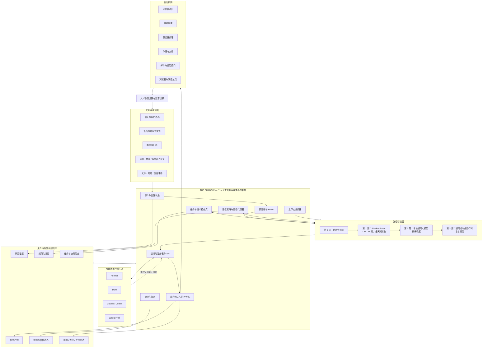

# OpenShadow

**中文版** | [英文版](README_EN.md)

OpenShadow 是一个**本地优先、运行时无关的个人人工智能连续性与控制层**。

它不试图成为另一个“大而全”的智能体。Shadow 负责长期持有那些应该跨模型、跨智能体、跨设备、跨时间持续存在的个人状态：身份、记忆、任务、能力、规则、历史与世界状态。Hermes、DeepSeek Harness、Claude、Codex 以及未来出现的新运行时，只负责推理和执行。

> **Shadow 持有连续性。**  
> 运行时负责推理和执行，但不拥有用户的持久状态。

## 为什么要做 OpenShadow

模型越来越强，但一个人与人工智能之间的长期关系仍然很脆弱。今天大量个人状态仍然被锁在某一个产品、会话或框架中：换模型、换运行时、换设备、换服务，往往意味着重新迁移记忆、任务、工具、权限与上下文。

OpenShadow 想解决的不是“模型还不够聪明”，而是一个更长期的问题：

> **如果未来十年模型、智能体框架和人工智能产品不断换代，什么东西应该一直留下来？**

我们的答案是：**用户本身，以及围绕这个用户持续积累的长期状态。**

这包括：

- 用户是谁、重视什么、有哪些长期约束；
- 正在做什么、已经做到哪里；
- 曾经做过哪些决定、为什么这样决定；
- 已经建立了哪些能力、自动化与流程；
- 当前数字世界和物理世界处于什么状态；
- 哪些智能体可以读取什么、执行什么；
- 过去的经验如何影响下一次行动。

这些东西不应该属于某一代模型，也不应该随着某个运行时的消失而消失。

OpenShadow 同样不接受“常驻人工智能就必须让一个大模型持续在线”的前提。系统采用**分层智能和按需升级**：确定性事件先交给规则与普通代码，极小本地模型 Pulse 负责全天候注意力判断，更大的本地模型与智能体运行时只在真正需要时被唤醒。

## 设计愿景

### 1. 人工智能应该不断积累，而不是不断重新开始

今天很多人工智能产品，本质上仍然是一次次临时工作区。即使拥有记忆能力，长期状态往往也依附于具体产品本身。

OpenShadow 希望把下面这种模式：

```text
使用某个智能体
      ↓
形成一批临时上下文
      ↓
产品或运行时更换
      ↓
重新开始
```

变成：

```text
                    个人连续性
                        │
          ┌─────────────┼─────────────┐
          ▼             ▼             ▼
       运行时甲       运行时乙       运行时丙
          │             │             │
          └────── 持续向个人资产贡献 ──────┘
                        │
                        ▼
             记忆 · 任务 · 能力 · 历史
                     持续增长
```

模型和智能体应该像应用程序一样可以替换，但用户的数字连续性应该持续积累，而不是不断清零。

### 2. 持久状态应该真正属于用户

未来最有价值的人工智能资产，未必是某一个模型，而可能是多年累积出来的：

```text
个人原始证据
     ↓
规范化记忆
     ↓
任务与决策历史
     ↓
能力与流程
     ↓
规则与信任边界
     ↓
经验、注意力与偏好模型
```

OpenShadow 希望这些资产具备三个属性：

- **用户所有** —— 属于用户，而不是某个供应商或运行时；
- **可迁移** —— 可以继续被未来的新模型、新智能体使用；
- **可审计** —— 能知道一条状态从哪里来、为什么存在、什么时候被调用和修改。

从这个角度看，Shadow 沉淀的不是“聊天记录”，而是一套逐渐增长的**个人数字生产资料**。

### 3. 智能体可以替换，但人不能替换

OpenShadow 的一个核心判断是：

> **智能体是可替换的执行资源，个人连续性不是。**

今天可以选择 Hermes，明天可以切换到 DSH，复杂代码任务可以交给 Claude 或 Codex，未来出现的新运行时也可以直接接入。

真正不应该随着这些变化一起迁移的是：

```text
身份
记忆
任务
能力
规则
历史与世界状态
```

OpenShadow 不试图预测“最终哪个智能体会赢”，而是让这个问题本身变得不再重要：**无论谁更强，用户都能直接使用它，同时保留过去所有积累。**

### 4. 个人人工智能不应该只在聊天时存在

真正长期存在的个人人工智能，不应该只在打开聊天窗口时才开始工作。

世界一直在变化：

```text
邮件到达
日历变化
服务器状态恶化
家庭设备状态改变
任务截止时间接近
文件发生变化
用户所处模式改变
```

因此 Shadow 必须拥有自己的事件、状态、调度和注意力机制：

```text
世界持续变化
     ↓
事件与世界状态
     ↓
确定性规则
     ↓
Shadow Pulse
     ↓
这件事值得注意吗？
   ├─ 否 → 继续观察
   └─ 是 → 创建任务 → 调用运行时 → 执行能力
```

即使所有聊天界面都被删除，Shadow 也应该继续存在并发挥作用。

### 5. 智能应该是弹性的

全天候运行，不意味着全天候使用最昂贵的智能。

OpenShadow 把智能看作一种可以逐级投入的计算资源：

```text
第 0 层：确定性规则
        ↓
第 1 层：Shadow Pulse
        极小本地模型
        ↓
第 2 层：本地通用大模型
        ↓
第 3 层：通用或专业运行时
```

大多数事件应该在最便宜且足够的层级结束，只有真正重要、复杂或不确定的问题才继续升级。

这样，“持续存在的个人人工智能”才能在工程上长期运行，而不是依赖持续消耗大量算力和令牌的心跳机制。

### 6. 人工智能能力应该逐渐变成基础设施

很多个人人工智能项目最后都会变成一堆相互隔离的一次性脚本：邮箱智能体、家庭智能体、服务器智能体、研究智能体，各自重新接鉴权、工具、权限、状态和上下文。

OpenShadow 希望把这些现实世界能力沉淀为统一的能力层。一旦邮箱、日历、文件、家庭设备、服务器等能力接入完成，未来新的智能体就不需要重新“拥有”这些系统，只需要通过 Shadow 在规则允许的范围内使用它们。

> **一次接入，持续复用；一次积累，被未来所有智能体继承。**

## 这个项目为什么重要

### 跨人工智能世代保持连续性

一个人的生命周期远长于一个模型的生命周期。

```text
提示词与界面选择      天到周
模型                  月
智能体运行时          月到年
能力提供者            年
Shadow 核心契约       年
个人历史              数十年
```

越靠近个人本身的状态，越应该稳定、可迁移并由用户自己持有。

### 避免个人上下文碎片化

未来一个人可能同时使用编码、研究、家庭、健康、工作、沟通等多个智能体。如果每个智能体都维护一份自己的“用户画像”和任务历史，就会形成多个互相矛盾的“你”。

OpenShadow 希望提供统一的个人连续性平面，让不同智能系统面对同一个身份、同一套规则、同一套任务状态和可追溯的长期记忆。

### 让越来越强的智能体仍然处于可控边界内

智能体越能行动，权限与治理就越重要。

Shadow 不把“模型理解了用户意图”视为足够的授权：

```text
模型提出动作
     ↓
Shadow 规则判断
     ↓
审批 · 幂等 · 审计
     ↓
能力执行
```

目标不是限制智能体，而是让更强的智能体能够在一个更可信、更可控的执行环境中工作。

### 把多年人工智能使用变成可复利资产

如果设计正确，几年后的 Shadow 应该比刚安装时更有价值，因为它会不断积累：

- 更完整的原始历史与证据；
- 更准确、可追溯的规范化记忆；
- 已验证的任务轨迹与决策历史；
- 越来越丰富的能力；
- 可复用的流程与工作方法；
- 更成熟的权限与信任边界；
- 更了解什么值得用户注意的个性化注意力策略。

理想情况下形成长期复利：

```text
更多真实使用
     ↓
更丰富的证据
     ↓
更好的上下文与规则
     ↓
更好的任务委派
     ↓
更多可复用能力
     ↓
更多真实使用
```

OpenShadow 希望把人工智能使用从一种持续消费的服务，逐渐变成一种**可以持续积累的个人基础设施**。

## 长期方向

OpenShadow 的长期目标不是成为“唯一的智能体”，也不是在现有智能体之上再套一个聊天入口。

它希望成为一个**寿命长于任何单一模型、运行时和人工智能产品的个人基础设施层**：持续感知用户的数字与物理世界，维护属于用户的长期状态，把合适的问题交给当时最合适的智能系统，并通过统一的能力与治理层把决策安全地作用回现实世界。

### 目标形态



OpenShadow 希望刻意制造一种“不对称”：**越容易被技术浪潮替代的东西，越应该放在外围；越属于用户本人、越难重新获得的东西，越应该靠近核心。**

```text
变化快 / 易替换

提示词与交互界面
模型
智能体运行时
记忆与检索引擎
能力提供者
────────────────────
Shadow 核心契约与治理
规范化个人状态
原始证据与个人历史
────────────────────
变化慢 / 用户所有
```

未来无论模型家族切换、Hermes 被替代、记忆技术升级、工具协议变化、设备生态变化，还是交互方式从聊天迁移到语音、眼镜或环境式界面，理想情况下都只需要替换外围实现或适配器，而不是重建一个人的人工智能生活。

### 长期存在，但不做成巨型单体

“长期存在”不意味着让一个巨大模型永远运行。

```text
全天候低功耗层
├─ 事件接入
├─ 世界状态
├─ 调度器
├─ 规则系统
├─ 任务持久化
├─ 确定性判断
└─ Shadow Pulse

按需计算层
├─ 本地通用大模型
├─ Hermes / DSH
├─ Claude / Codex
└─ 未来专业运行时
```

稳定部分应该尽量小、便宜、可审计、可长期维护；昂贵智能只在真正需要时被唤醒。

### 从“助手”走向“个人数字基础设施”

如果 OpenShadow 成功，多年后最重要的成果不应该是某个固定助手人格，而应该是长期沉淀下来的基础设施：

- 原始个人历史；
- 规范化记忆；
- 世界状态；
- 任务与检查点；
- 能力；
- 规则与信任边界；
- 流程与工作方法；
- 任务轨迹与经验；
- 个性化注意力策略。

> **十年后模型已经完全不同，但你的人工智能不需要重新认识你。**

> **The Shadow is always there.**

## 核心原则

- **核心尽量薄，责任足够深** —— 只持有那些必须跨运行时、跨模型、跨设备、跨年份保持一致的状态。
- **运行时无关** —— 运行时只是可替换执行器，永远不成为用户持久状态的唯一事实源。
- **本地优先** —— 个人原始证据、记忆和控制状态默认保存在本地。
- **用户持有连续性** —— 记忆、任务、能力、规则和历史属于用户。
- **原始证据优先** —— 原始证据是长期事实源；规范化记忆可以修正；索引与派生层可以重建。
- **记忆调取是一种决策** —— 调取什么记忆由当前任务的决策价值决定，而不是只看向量相似度。
- **分层智能** —— 越昂贵的智能，越晚进入执行路径。
- **最小充分注意力** —— 全天候常驻层只使用足以完成注意力判断的最小模型或分类器。
- **模型提出，Shadow 决定，能力执行** —— 所有现实副作用必须经过规则、审批、幂等与审计。

## 架构概览

### 连续性层

```text
交互与事件
    ↓
Shadow 连续性与控制核心
    ↓
┌────────────┬────────────┬────────────┬────────────┐
│            │            │            │
可替换运行时  可替换记忆引擎  能力提供者   持久化数据
```

### 分层智能

```text
用户意图 / 外部事件
        ↓
第 0 层：确定性规则
        ↓
第 1 层：Shadow Pulse
0.5B–3B 级，全天候常驻
        ↓
第 2 层：本地通用大模型
        ↓
第 3 层：通用或专业运行时
```

Pulse 以事件驱动为主。心跳只负责状态校验、补偿和没有自然事件源的条件检查，而不是反复唤醒大模型询问“有没有事情要做”。

## Shadow 持有什么

| Shadow 持有 | 优先复用或外包 |
| --- | --- |
| 身份与规则 | 智能体循环与规划 |
| 规范化任务与语义检查点 | 浏览器智能体 |
| 原始证据与规范化记忆契约 | 向量、嵌入与图检索引擎 |
| 记忆策略与记忆代理器 | Mem0、LangMem、Graphiti |
| 事件与世界状态 | Home Assistant 等设备驱动 |
| 能力注册表、能力网关与执行台账 | 邮件、日历、浏览器与服务器能力提供者 |
| SRI、运行时路由与升级 | Hermes、DSH、Claude、Codex |
| 上下文编译器 | 消息网关与聊天平台 |
| 调度策略与 Pulse 策略 | 语音、模型服务与 Pulse 模型实现 |

## v0.1 最小可行版本

第一版只验证“连续性层是否成立”和“动态运行机制是否成立”，不追求做出一个完整的个人人工智能产品。

1. 事件存储与世界状态投影
2. 确定性规则、可替换极小 Pulse、事件驱动唤醒
3. 不经过通用运行时的快速路径
4. 规范化任务、语义检查点、任务工作记忆
5. 记忆契约、记忆策略、记忆代理器、记忆包与深度回溯
6. SRI、Hermes 适配器、DSH 适配器
7. 上下文编译器
8. 能力注册表、能力网关、执行台账与幂等
9. 基础规则与审批
10. 调度器与等待任务恢复
11. PostgreSQL 与 pgvector
12. 最小管理界面与命令行
13. 本地优先的 Docker Compose 单机部署

### 必须通过的验证场景

- **运行时连续性** —— Hermes 中断后，DSH 能从语义检查点继续同一个任务。
- **跨运行时记忆** —— 一个运行时形成的长期记忆可以被另一个运行时正确调用。
- **自主事件处理** —— 没有用户提示时，事件也可以触发规则或 Pulse，创建任务、调用运行时并产生结果。
- **分层智能** —— 大量低价值事件在低成本层结束，仅少量任务升级到昂贵运行时。
- **运行时升级** —— 候选运行时可以经过历史回放、灰度、晋升或回滚，而用户状态不需要迁移。
- **任务感知记忆** —— 相比简单的向量相似度前若干条检索，减少无关上下文，并在需要时回溯原始历史。
- **副作用安全** —— 运行时崩溃与重试不会重复执行已经完成的外部动作。

## 文档

### 产品与总览

- [需求与总体设计](docs/requirements.md)
- [架构总览](docs/architecture.md)
- [开发路线](docs/roadmap.md)
- [架构决策记录](docs/adr/README.md)

### 详细架构

- [分层智能与 Shadow Pulse](docs/architecture/intelligence.md)
- [事件与世界状态](docs/architecture/event-state.md)
- [任务与语义检查点](docs/architecture/task.md)
- [记忆架构](docs/architecture/memory.md)
- [运行时架构与连续性](docs/architecture/runtime.md)
- [能力与治理](docs/architecture/capability.md)
- [部署架构](docs/architecture/deployment.md)

## 当前状态

**设计基线 / 最小可行版本实现前阶段。** 当前产品边界和主要动态架构已经确定，下一阶段进入核心契约、详细设计、PostgreSQL 数据结构、接口设计与最小可行版本实现。
