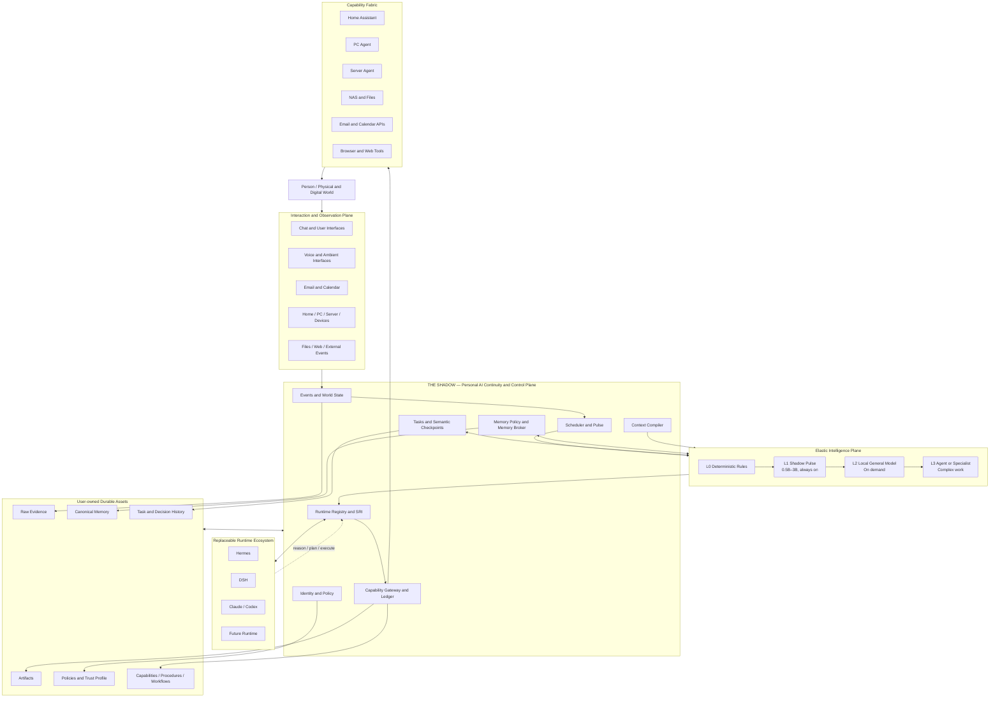

# OpenShadow

[Chinese](README.md) | **English**

OpenShadow is a **local-first, runtime-neutral Personal AI Continuity & Control Layer**.

It is not intended to become another all-in-one agent. Shadow owns the durable personal state that should survive changes in models, agents, devices, and time: identity, memory, tasks, capabilities, policies, history, and world state. Hermes, DeepSeek Harness, Claude, Codex, and future runtimes are replaceable reasoning and execution engines.

> **Shadow owns the continuity.**  
> Runtimes own reasoning and execution, never durable user state.

## Why OpenShadow

Models are improving quickly, but the long-term relationship between a person and AI is still fragile. Personal state is usually trapped inside a specific product, session, or framework. Replacing a model, runtime, device, or service often means rebuilding context, migrating tools, restoring preferences, and starting over.

OpenShadow is built around a different question:

> **If models, agent frameworks, and AI products keep changing for the next decade, what should remain stable?**

Our answer is: **the person, and the durable state accumulated around that person.**

That includes:

- who the user is and what constraints matter;
- what they are working on and how far it has progressed;
- what decisions were made and why;
- which capabilities, automations, and procedures have already been built;
- what is currently true in the user's digital and physical environment;
- which agents may access which data and perform which actions;
- how past experience should influence future decisions.

These assets should not belong to one generation of models or disappear with one agent runtime.

OpenShadow also rejects the assumption that an always-on personal AI requires an expensive large model to run continuously. It uses **layered intelligence and on-demand escalation**: deterministic rules handle obvious events, a tiny local Pulse model provides 24/7 attention, and larger local models or agent runtimes wake only when richer reasoning is necessary.

## Design vision

### 1. AI should accumulate, not reset

Most AI products still behave like temporary workspaces. Even when they support memory, durable state usually remains tied to the product itself.

OpenShadow aims to turn this:

```text
Use an agent
    ↓
Build temporary context
    ↓
Product or runtime changes
    ↓
Start again
```

into this:

```text
                 Personal continuity
                         │
           ┌─────────────┼─────────────┐
           ▼             ▼             ▼
        Runtime A     Runtime B     Runtime C
           │             │             │
           └──── continuously contribute ────┘
                         │
                         ▼
        Memory · Tasks · Capabilities · History
                    keep growing
```

Models and agents should be replaceable like applications. Personal continuity should keep compounding instead of being reset.

### 2. Durable state should belong to the user

The most valuable long-term AI asset may not be any single model. It may be the state accumulated over years:

```text
Raw personal evidence
        ↓
Canonical memory
        ↓
Task and decision history
        ↓
Capabilities and procedures
        ↓
Policies and trust profile
        ↓
Experience, attention, and preference models
```

OpenShadow wants those assets to be:

- **User-owned** — controlled by the user rather than a runtime or vendor;
- **Portable** — reusable by future models and agents;
- **Auditable** — traceable to their origin, use, modification, and validity.

Shadow is therefore not merely collecting chat logs. It is building a growing set of **personal digital production assets**.

### 3. Agents are replaceable; the person is not

OpenShadow makes one architectural bet:

> **Agents are consumable execution resources. Personal continuity is not.**

Hermes can be the best choice today. DSH may become better tomorrow. Claude or Codex may handle specialist work. A future runtime may replace all of them.

The durable state should not migrate every time execution technology changes:

```text
Identity
Memory
Tasks
Capabilities
Policies
History and world state
```

OpenShadow does not try to predict which agent will ultimately win. It tries to make that question less important.

### 4. Personal AI should exist even when nobody is chatting with it

A persistent personal AI should not begin and end with a chat window.

The world changes continuously:

```text
Email arrives
Calendar changes
Server health degrades
Home state changes
A deadline approaches
Files change
The user's current mode changes
```

Shadow therefore has its own event, state, scheduling, and attention mechanisms:

```text
World changes
     ↓
Events and world state
     ↓
Deterministic rules
     ↓
Shadow Pulse
     ↓
Does this deserve attention?
   ├─ no  → keep observing
   └─ yes → task → runtime → capability
```

Even if every chat interface is removed, Shadow should remain useful and operational.

### 5. Intelligence should be elastic

Running continuously does not mean using the most expensive intelligence continuously.

OpenShadow treats intelligence as an elastic resource:

```text
L0  Deterministic rules
        ↓
L1  Shadow Pulse
    tiny local model
        ↓
L2  Local general model
        ↓
L3  General or specialist runtime
```

Most events should terminate at the cheapest sufficient layer. Only important, uncertain, or complex work should escalate.

The goal is to make persistent personal AI economically and operationally sustainable rather than a permanent high-token heartbeat.

### 6. Capabilities should become infrastructure

Personal AI projects often become isolated scripts: one email agent, one home agent, one server agent, one research agent. Each project reconnects authentication, tools, permissions, state, and context.

OpenShadow instead turns real-world abilities into a reusable capability fabric. Once email, calendar, files, home automation, or server operations are integrated, future agents should not need to own those systems again. They should receive governed access through Shadow.

> **Integrate once, reuse continuously. Build once, let future agents inherit it.**

## Why this matters

### Continuity across AI generations

The lifecycle of a person is much longer than the lifecycle of a model.

```text
Prompts and interface choices     days to weeks
Models                            months
Agent runtimes                    months to years
Capability providers              years
Shadow contracts                  years
Personal history                  decades
```

The closer a piece of state is to the person, the more stable and user-owned it should become.

### Preventing personal context fragmentation

A future user may simultaneously rely on coding, research, home, health, work, and communication agents. If each one maintains its own version of the user, the result is several inconsistent copies of the same person.

OpenShadow aims to provide one personal continuity plane so that different agents operate against the same identity, policies, task state, and traceable memory.

### Keeping humans in control of increasingly capable agents

As agents gain the ability to act, governance matters as much as reasoning quality.

OpenShadow does not treat model confidence as authorization:

```text
Model proposes an action
        ↓
Shadow policy evaluation
        ↓
Approval · Idempotency · Audit
        ↓
Capability executes
```

The objective is not to make agents weaker. It is to let stronger agents operate inside a more trustworthy control environment.

### Turning years of AI use into compounding assets

A well-designed Shadow installation should become more valuable over time because it accumulates:

- richer raw evidence;
- better canonical memory;
- task trajectories and decision history;
- more reusable capabilities;
- proven procedures and workflows;
- a more mature trust and permission profile;
- a more personalized attention policy.

The intended flywheel is:

```text
more real usage
      ↓
richer evidence
      ↓
better context and policies
      ↓
better delegation
      ↓
more useful capabilities
      ↓
more real usage
```

OpenShadow aims to turn AI use from continuous consumption into **personal infrastructure that compounds**.

## Long-term direction

OpenShadow is not trying to become the only agent. It is trying to become a layer that can outlive any individual model, runtime, or AI product.

It should continuously observe the user's digital and physical world, maintain durable user-owned state, delegate work to the best available intelligence, and safely route approved actions back into the real world.

### Target end-state



The desired asymmetry is simple: **the easier something is to replace, the farther it should sit from the core; the more personal and difficult it is to recreate, the closer it should sit to the core.**

```text
Fast-changing / Replaceable

Prompts and interfaces
Models
Agent runtimes
Memory and search engines
Capability providers
────────────────────────────
Shadow contracts and governance
Canonical personal state
Raw evidence and personal history
────────────────────────────
Slow-changing / User-owned
```

A model family may change. Hermes may be replaced. Memory technology may improve. Tool protocols may evolve. Device ecosystems may change. Chat may give way to voice, glasses, or ambient interfaces. Ideally, these changes should require replacing an adapter or peripheral implementation, not rebuilding a person's AI life.

### Persistent, but not monolithic

Persistence does not mean keeping one giant model running forever.

```text
Always-on low-power layer
├─ event ingestion
├─ world state
├─ scheduler
├─ policies
├─ task persistence
├─ deterministic rules
└─ Shadow Pulse

On-demand compute layer
├─ local general model
├─ Hermes / DSH
├─ Claude / Codex
└─ future specialist runtimes
```

The stable part should remain small, cheap, inspectable, and durable. Expensive intelligence should wake only when needed.

### From assistant to personal digital infrastructure

If OpenShadow succeeds, the most important artifact after years of use will not be a particular assistant personality. It will be the accumulated infrastructure:

- raw personal history;
- canonical memory;
- world state;
- tasks and checkpoints;
- capabilities;
- policies and trust boundaries;
- procedures and workflows;
- task trajectories and experience;
- personal attention policy.

> **Ten years from now, the models may be completely different, but your AI should not need to meet you again.**

> **The Shadow is always there.**

## Core principles

- **Thin core, deep responsibility** — Keep the core small, but let it own what must remain stable across runtimes, models, devices, and years.
- **Runtime-neutral** — Runtimes are replaceable executors and never the source of truth for durable user state.
- **Local-first** — Personal evidence, memory, and control state are local by default.
- **User-owned continuity** — Memory, tasks, capabilities, policies, and history belong to the user.
- **Raw evidence first** — Raw evidence is the long-term source of truth; canonical memory may change; derived indexes are rebuildable.
- **Retrieval is a decision** — Memory retrieval is based on decision relevance to the current task, not vector similarity alone.
- **Layered intelligence** — The more expensive the intelligence, the later it enters the execution path.
- **Smallest sufficient attention** — The always-on layer should use the smallest model or classifier that can make a useful attention decision.
- **Model proposes; Shadow decides; capability executes** — Side effects must pass policy, approval, idempotency, and audit controls.

## Architecture

### Continuity layer

```text
Interaction and events
          ↓
Shadow continuity and control core
          ↓
┌───────────────┬────────────────┬────────────────────┐
│               │                │                    │
Replaceable   Replaceable      Capability          Durable
runtimes      memory engines   providers           storage
```

### Layered intelligence

```text
User intent / events
        ↓
L0 deterministic rules
        ↓
L1 Shadow Pulse
0.5B–3B class, always on
        ↓
L2 local general model
        ↓
L3 runtime / specialist
```

Pulse is event-driven first. Heartbeats are used for reconciliation and conditions without natural event sources, not to repeatedly wake a large agent.

## What Shadow owns

| Shadow owns | Reuse or outsource |
| --- | --- |
| Identity and policy | Agent loops and planning |
| Canonical tasks and semantic checkpoints | Browser agents |
| Raw evidence and canonical memory contracts | Embedding, vector, and graph engines |
| Memory policy and broker | Mem0, LangMem, Graphiti |
| Events and world state | Home Assistant device drivers |
| Capability registry, gateway, and ledger | Email, calendar, browser, and server providers |
| SRI, runtime routing, and upgrades | Hermes, DSH, Claude, Codex |
| Context compiler | Messaging gateways and chat platforms |
| Scheduler and Pulse policy | Speech, model serving, and Pulse model implementation |

## v0.1 MVP

The first version exists to validate continuity and dynamic execution, not to build a complete personal AI product.

1. Event store and world-state projection
2. Deterministic rules, pluggable tiny Pulse, and event-driven wakeups
3. Fast paths that bypass the general runtime
4. Canonical tasks, semantic checkpoints, and task working memory
5. Memory contract, memory policy, memory broker, memory bundles, and deep recall
6. SRI with Hermes and DSH adapters
7. Context compiler
8. Capability registry, gateway, execution ledger, and idempotency
9. Basic policy and approval
10. Scheduler and waiting-task resume
11. PostgreSQL and pgvector
12. Minimal web console and CLI
13. Local-first Docker Compose deployment

### Must-pass demonstrations

- **Runtime continuity** — A task interrupted in Hermes can continue in DSH from a semantic checkpoint.
- **Cross-runtime memory** — Durable memory created through one runtime can be correctly used by another.
- **Autonomous event handling** — Events can trigger rules or Pulse, create tasks, invoke runtimes, and produce results without a user prompt.
- **Layered intelligence** — Most low-value events terminate in cheap layers; only a small fraction escalate to expensive runtimes.
- **Runtime upgrade** — A candidate runtime can be replayed, canaried, promoted, or rolled back without migrating user state.
- **Task-aware memory** — Memory retrieval improves decision relevance over naive vector top-k and can fall back to deep recall of raw history.
- **Side-effect safety** — Runtime crashes and retries do not duplicate completed external actions.

## Documentation

### Product and overview

- [Requirements and System Design](docs/requirements.md)
- [Architecture Overview](docs/architecture.md)
- [Roadmap](docs/roadmap.md)
- [Architecture Decision Records](docs/adr/README.md)

### Detailed architecture

- [Intelligence Plane and Shadow Pulse](docs/architecture/intelligence.md)
- [Events and World State](docs/architecture/event-state.md)
- [Tasks and Semantic Checkpoints](docs/architecture/task.md)
- [Memory Architecture](docs/architecture/memory.md)
- [Runtime Architecture and Continuity](docs/architecture/runtime.md)
- [Capability and Governance](docs/architecture/capability.md)
- [Deployment Architecture](docs/architecture/deployment.md)

## Status

**Design baseline / pre-MVP.** Product boundaries and the main dynamic architecture are now defined. The next stage is to formalize core contracts, low-level design, PostgreSQL schemas, APIs, and MVP implementation.
