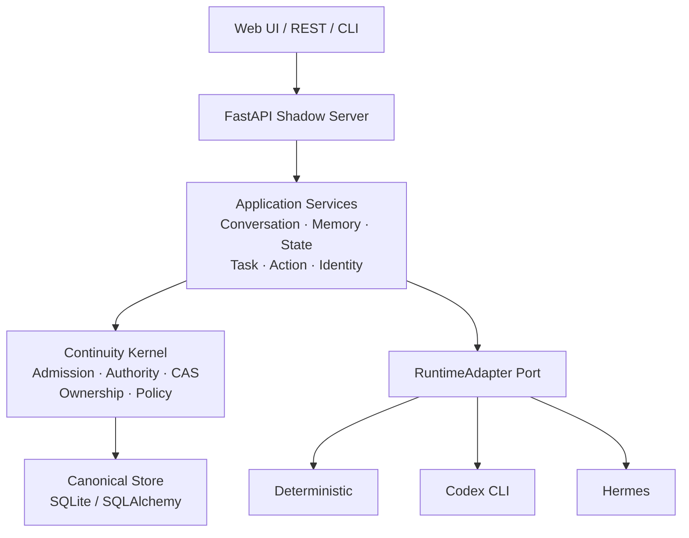

<h1 align="center">OpenShadow</h1>

<p align="center">
  <strong>A continuity layer for personal AI.</strong><br/>
  Keep AI identity, memory, tasks, and long-lived assets independent from any model or Agent Runtime.
</p>

<p align="center">
  <em>Replace the runtime. Keep the Shadow.</em>
</p>

<p align="center">
  
  
  
  
  
</p>

<p align="center">
  <a href="README.md">中文</a> · <strong>English</strong> ·
  <a href="docs/architecture.md">Architecture</a> ·
  <a href="docs/roadmap.md">Roadmap</a> ·
  <a href="docs/adr/README.md">ADR</a>
</p>

---

## What is OpenShadow?

OpenShadow is a **local-first, vendor-neutral Personal AI Continuity Layer**.

It does not try to rebuild an Agent Framework. Instead, it separates the user assets that should survive over time from the Runtime that happens to execute AI workloads today:

- Identity / Space
- Conversation / Memory / State
- Durable Task / Action
- Skill / Integration metadata
- Ownership / Policy / Governance

Models, Agent Runtimes, Memory Engines, and storage backends can be replaced while the Shadow keeps its long-lived identity and assets.

```text
    Model / Runtime / Memory Engine
              replaceable
                   │
                   ▼
        ┌────────────────────┐
        │     OpenShadow     │
        │                    │
        │ identity · memory  │
        │ state · task · run │
        │ policy · ownership │
        └─────────┬──────────┘
                  │
                  ▼
          User-owned Assets
```

> **The Runtime thinks and acts; OpenShadow owns long-term identity, assets, continuity, and governance.**

---

## Why OpenShadow?

The AI stack changes quickly: models change, Runtimes change, Memory systems change, and Agent Frameworks change.

If long-lived state is tied directly to a Runtime's private session or database, replacing that component often means rebuilding context from scratch. OpenShadow separates **stable user sovereignty** from **fast-moving intelligence and execution**.

The core rule is simple:

> **External intelligence may propose. Only Shadow commits.**

A Runtime may return a Result, Observation, or Proposal, but it cannot bypass Shadow and directly mutate long-lived Canonical State.

---

## Architecture



OpenShadow currently uses a **modular monolith** architecture:

- Kernel owns long-lived invariants and Canonical Commit
- Application owns Conversation / Memory / State / Task / Action flows
- Runtime Adapters provide replaceable intelligence and execution
- Canonical Store preserves user-owned long-lived assets
- Vendor-specific behavior stays inside Adapter boundaries

See [`docs/architecture.md`](docs/architecture.md) for the full design.

---

## Current Status

The current `main` branch implements **Phase 0–4** and the **Phase 5 Core Slice**.

| Capability | Status |
| --- | :---: |
| Identity / Space / Ownership | ✅ |
| Conversation & Runtime Dispatch | ✅ |
| Canonical Memory | ✅ |
| State & Observation | ✅ |
| Durable Task / Checkpoint / Recovery | ✅ |
| Action Proposal & Approval | ✅ |
| Runtime Adapter & Capability Negotiation | ✅ |
| Codex CLI Adapter | ✅ |
| Hermes HTTP Adapter | ✅ |
| Skill / Integration Metadata | ✅ |
| Router / Policy | ✅ |
| Export / Import / Erasure | ✅ |
| Multi-endpoint / Multi-user Core | ✅ |
| Web Management UI | ✅ |
| Docker / Metrics / Health / Readiness | ✅ |

The following areas still need validation in real deployment environments:

- OIDC / external IdP
- PostgreSQL production deployment
- Long-running Hermes / Codex operation
- Backup / Restore
- Multi-device Sync
- Production load / chaos / security testing

See [`docs/roadmap.md`](docs/roadmap.md) for detailed delivery status.

---

## Runtime Support

Runtimes connect through a common `RuntimeAdapter` boundary.

| Runtime | Purpose |
| --- | --- |
| `deterministic` | Model-free development and test baseline |
| `codex` | Codex CLI Runtime |
| `hermes` | Hermes HTTP Runtime |

The base Runtime Port is intentionally small:

```text
describe()
execute()
events()
```

Additional features are declared through Capability Negotiation, including `cancel`, `checkpoint`, `native_resume`, `semantic_handoff`, `progress`, `usage`, and `reconciliation`.

A new Runtime should therefore be added without changing OpenShadow Core.

---

## Quick Start

Current reference environment: **Windows + Python 3.12+ + SQLite**.

```powershell
git clone https://github.com/wzw57/OpenShadow.git
Set-Location OpenShadow

py -3.12 -m venv .venv
.\.venv\Scripts\Activate.ps1
python -m pip install -e ".[dev]"

New-Item -ItemType Directory -Force .shadow | Out-Null
alembic upgrade head

powershell -NoProfile -ExecutionPolicy Bypass `
  -File .\scripts\start-shadow-management.ps1 `
  -Build -OpenBrowser
```

After startup:

| Service | URL |
| --- | --- |
| Web UI | `http://127.0.0.1:8765/ui/` |
| API Docs | `http://127.0.0.1:8765/docs` |
| Health | `http://127.0.0.1:8765/healthz` |
| Readiness | `http://127.0.0.1:8765/readyz` |

### Use Codex Runtime

```powershell
powershell -NoProfile -ExecutionPolicy Bypass `
  -File .\scripts\start-shadow-management.ps1 `
  -Build -RuntimeId codex -AutoStartRuntime -OpenBrowser
```

Default data is stored in `.shadow/shadow.db`.

---

## Repository

```text
OpenShadow/
├─ packages/
│  ├─ shadow-kernel/
│  └─ shadow-application/
│
├─ adapters/
│  ├─ store-sqlite/
│  ├─ test-deterministic/
│  ├─ codex-agent/
│  └─ hermes-agent/
│
├─ apps/
│  ├─ shadow-server/
│  └─ shadow-web/
│
├─ contracts/
├─ config/
├─ migrations/
├─ docs/
├─ scripts/
└─ tests/
```

---

## Tech Stack

| Layer | Stack |
| --- | --- |
| Backend | Python 3.12+ |
| API | FastAPI |
| Validation | Pydantic 2 / JSON Schema |
| Persistence | SQLAlchemy 2 / SQLite |
| Migration | Alembic |
| Web | React 19 / TypeScript / Vite |
| Contract | OpenAPI 3.1 |
| Testing | pytest / httpx |
| Quality | Ruff |

---

## Design Principles

**User-owned assets > Runtime-owned state**  
Long-lived assets belong to the user, not to a model, Runtime, or Memory Engine.

**Canonical state is authoritative**  
External intelligence may propose changes, but final Commit authority remains with Shadow.

**Keep the kernel small**  
The Kernel only owns long-lived semantics such as Identity, Ownership, Lifecycle, Admission, Authority, and Capability.

**Vendor isolation**  
Vendor-specific behavior stays inside Adapter boundaries.

---

## Documentation

| Document | Description |
| --- | --- |
| [`architecture.md`](docs/architecture.md) | System architecture and core boundaries |
| [`technical-architecture.md`](docs/technical-architecture.md) | Technical architecture |
| [`domain-model.md`](docs/domain-model.md) | Canonical Domain Model |
| [`roadmap.md`](docs/roadmap.md) | Current implementation status |
| [`implementation-stages.md`](docs/implementation-stages.md) | Phase 0–5 delivery plan |
| [`contract-baseline.md`](docs/contract-baseline.md) | API / Schema Contract |
| [`adr/`](docs/adr/README.md) | Architecture Decision Records |

---

## Project Scope

OpenShadow is currently a **local-first reference implementation**, not a complete production-grade Personal AI product.

Its main goal is to validate one idea:

> **A personal AI's long-lived identity and user-owned assets can exist independently from any specific model, Runtime, or Memory Engine.**

The next stage should focus less on adding abstractions and more on validating these boundaries with real Runtimes, real deployments, and long-running usage.

---

<p align="center">
  <strong>OpenShadow</strong><br/>
  <em>A personal AI should outlive its runtime.</em>
</p>