# OpenShadow Architecture

This document is the architecture entry point for the current OpenShadow v0.3 design baseline.

OpenShadow is deliberately designed as a **thin but deep Personal AI Continuity & Control Layer**. It does not try to become another all-in-one Agent framework. It owns the state that must survive models, runtimes, devices, sessions and years; replaceable systems provide intelligence and capabilities around that stable center.

> **Shadow owns the continuity.**  
> Runtime owns reasoning and execution — never durable user state.

---

## 1. Architecture at a glance

### 1.1 Continuity / ownership architecture

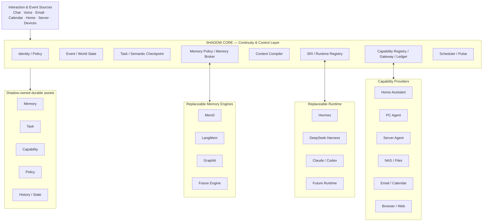

The key architectural distinction is ownership:

- **Shadow owns durable continuity.**
- **Runtime owns temporary reasoning / execution.**
- **Memory engines own algorithms / indexes, not canonical personal truth.**
- **Capability providers own implementation, not user-level capability contracts.**

### 1.2 Intelligence / execution architecture

OpenShadow is not designed to send every event or command to a large Agent.

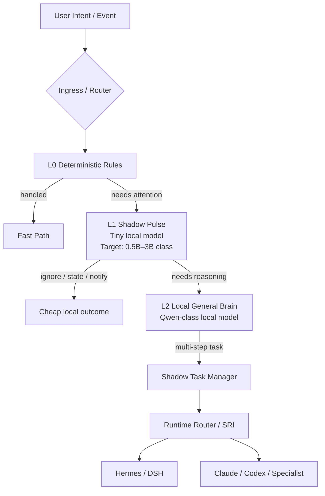

This layered design is central to 7×24 operation:

- L0 is ordinary code and rules;
- L1 Pulse is the low-cost always-on attention layer;
- L2 richer local intelligence is awakened on demand;
- L3 Agent Runtime / specialists handle complex work.

**Heartbeat is a reconciliation mechanism, not “ask a large Agent every N minutes whether something is happening.”**

See [Intelligence Plane & Shadow Pulse](architecture/intelligence.md).

---

## 2. Architecture document map

The overview intentionally stays compact. Detailed dynamic architecture is split into focused documents:

| Document | Answers |
| --- | --- |
| [Intelligence Plane & Pulse](architecture/intelligence.md) | How L0–L3 routing works; why a 0.5B–3B-class tiny model can remain always-on; Fast / Smart / Agent / Specialist paths |
| [Event & World State](architecture/event-state.md) | How events are normalized, persisted and projected into compact current state |
| [Task & Semantic Checkpoint](architecture/task.md) | How long-running work survives Runtime restarts, waiting and handoff |
| [Memory Architecture](architecture/memory.md) | How memory is written, consolidated, recalled, deep-recalled and evaluated |
| [Runtime Architecture](architecture/runtime.md) | SRI, Runtime Registry, semantic handoff, crash recovery, replay / canary upgrades |
| [Capability & Governance](architecture/capability.md) | Capability Registry, Gateway, Policy, Approval, Idempotency, Execution Ledger |
| [Deployment Architecture](architecture/deployment.md) | Always-on node, GPU server, NAS, edge agents, network zones, backup / degraded modes |

---

## 3. Ownership model

### Shadow owns

- Identity and long-lived Policy;
- append-oriented Event history;
- World State projections;
- Canonical Task and Task lifecycle;
- Semantic Checkpoint;
- Raw Evidence;
- Canonical Memory Contract and provenance;
- Memory Policy / Memory Broker;
- Task Working Memory;
- Capability Contract / Registry;
- Capability Execution Ledger;
- approvals and side-effect status;
- Runtime Registry and Task binding;
- Context Compiler;
- authoritative long-lived schedules;
- attention / escalation policy.

### Runtime owns temporary execution state

Runtime may own:

- Agent Loop;
- planning;
- hidden/internal reasoning;
- temporary model context;
- runtime-local Session;
- runtime-specific subagents;
- runtime-native tool orchestration;
- runtime-local compaction.

Runtime must not be the source of truth for durable user state.

---

## 4. Core logical modules

```text
shadow-core/
├── identity/
├── event/
├── world_state/
├── task/
├── checkpoint/
├── memory/
│   ├── contract/
│   ├── policy/
│   ├── broker/
│   └── feedback/
├── context/
├── runtime/
│   ├── sri/
│   ├── registry/
│   └── adapters/
├── capability/
│   ├── registry/
│   ├── gateway/
│   └── ledger/
├── policy/
├── scheduler/
└── pulse/
```

V0.1 is a **modular monolith**, not a microservice platform.

Logical modularity exists to preserve contracts and replacement boundaries; it does not require distributed deployment.

---

## 5. Event → World State → Attention

A long-lived system sees far more events than should reach an Agent.

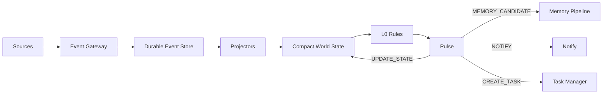

The default Runtime input is a compact task-relevant state view, not a replay of all historical events.

See [Event & World State](architecture/event-state.md).

---

## 6. Scheduler, Pulse and Task

These are not interchangeable concepts.

| Component | Responsibility |
| --- | --- |
| Scheduler | **When** should something be checked / resumed? |
| Pulse | **Does this situation deserve attention now?** |
| Task Manager | **What durable work must continue until completion?** |

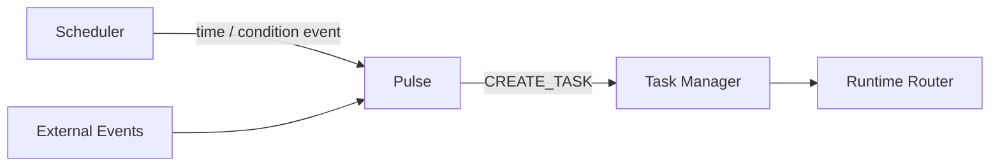

Pulse is event-driven first; heartbeat is mainly for reconciliation and conditions with no natural event source.

See [Intelligence Plane & Shadow Pulse](architecture/intelligence.md).

---

## 7. Task-aware Memory

OpenShadow Memory is not defined as `embedding → Top-K → prompt`.

### Write path

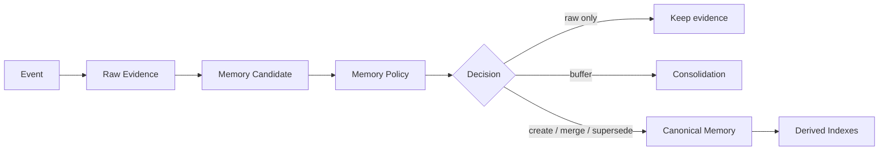

### Read path

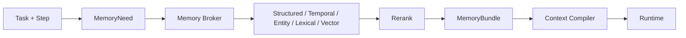

If Canonical Memory is insufficient, **Deep Recall** can inspect Raw Evidence, historical Tasks and Artifacts rather than forcing every useful historical detail into permanent RAG memory.

See [Memory Architecture](architecture/memory.md).

---

## 8. Task continuity and Runtime handoff

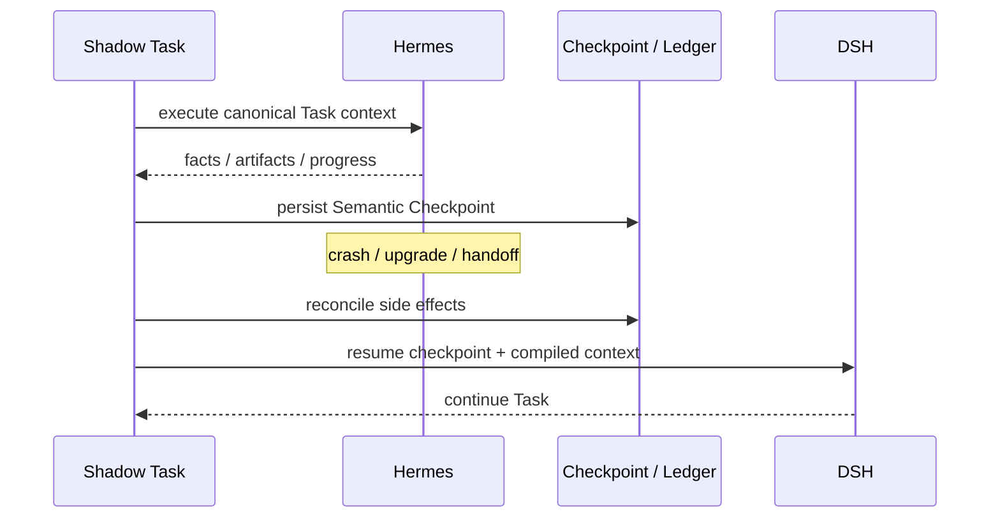

The continuity boundary is semantic:

- goal;
- progress;
- known facts;
- decisions / evidence;
- artifacts / tool results;
- remaining work;
- side-effect state.

Hidden chain-of-thought, token-level state and Runtime-private planner objects are not migration targets.

See [Task & Semantic Checkpoint](architecture/task.md) and [Runtime Architecture](architecture/runtime.md).

---

## 9. Context Compiler

Shadow maintains canonical task/context state and compiles it for the selected Runtime.

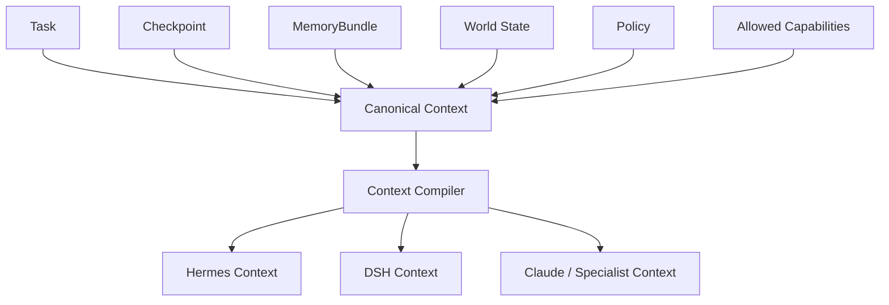

This is conceptually similar to a compiler IR: the semantic state stays stable while backend-specific input formats can change.

---

## 10. Safe Capability execution

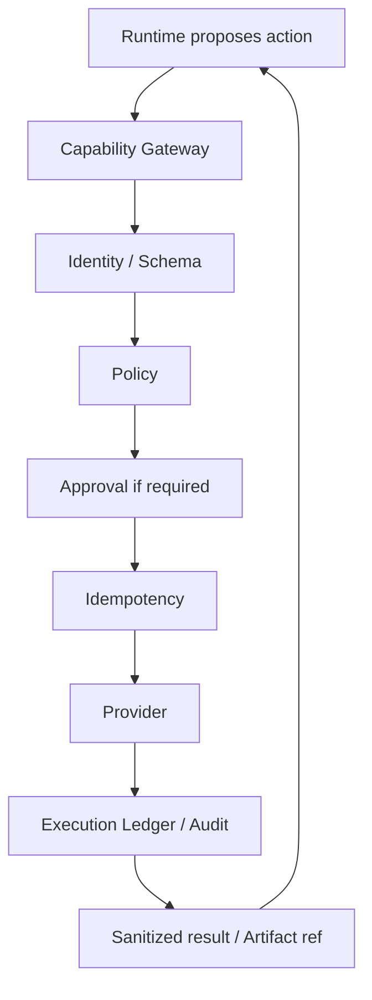

Key invariant:

> **LLM proposes; Shadow decides; Capability executes.**

Every important side effect is represented by an `action_id / idempotency_key`. Runtime crash recovery must not duplicate an already completed external action.

See [Capability & Governance](architecture/capability.md).

---

## 11. Runtime upgrade lifecycle

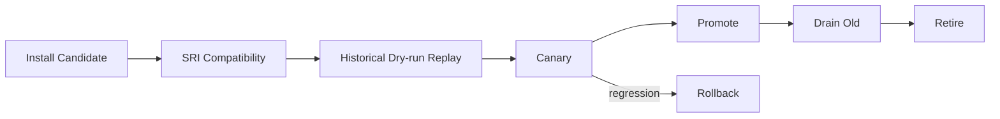

The upgrade must not require migrating Shadow-owned Memory, Task, Capability, Policy or History.

See [Runtime Architecture](architecture/runtime.md).

---

## 12. Persistence model

PostgreSQL is the V0.1 source of truth for structured durable state.

Suggested logical tables:

```text
users / identities
events
world_state
tasks
task_checkpoints
artifacts
memories
memory_links
memory_feedback
capabilities
providers
execution_ledger
runtimes
runtime_bindings
policies
approvals
schedules
```

`pgvector` is a derived retrieval index only.

Large Raw Evidence and Artifacts may live on local filesystem / NAS while PostgreSQL stores refs, hashes, provenance and lifecycle metadata.

---

## 13. Physical deployment

The recommended topology separates always-on continuity from expensive intelligence.

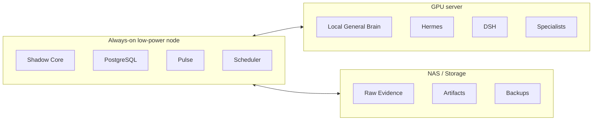

Shadow should remain capable of accepting events, updating state, maintaining Tasks and performing low-cost attention decisions even when the GPU server is off.

See [Deployment Architecture](architecture/deployment.md).

---

## 14. Trust boundaries

- Runtime never receives raw long-lived secrets by default.
- Cloud Runtime receives only context allowed by its trust profile.
- Sensitive Raw Evidence / Memory can remain local-only.
- Provider actions are mediated by Capability Gateway.
- High-risk actions require explicit approval policy.
- Important state-changing actions are auditable.
- PostgreSQL unavailability should fail closed for operations that require durable task / ledger writes.

---

## 15. Replaceable components

| Component | Replacement seam |
| --- | --- |
| General Runtime | SRI Adapter |
| Specialist Agent | Specialist / SRI Adapter |
| Memory Engine | Memory Provider Adapter |
| Vector / Search Engine | rebuild derived index |
| Home / PC / Server integration | Capability Provider |
| Messaging client | interaction adapter / webhook |
| LLM | Runtime / model configuration |
| Pulse model | Pulse model adapter / decision contract |

Architecture target: minimize **Upgrade Absorption Cost**. New technology should usually require a new adapter or rebuilt derived layer, not mutations to durable personal state.

---

## 16. Architectural guardrails

1. **Shadow owns the continuity.**
2. **No Runtime owns durable user state.**
3. **Raw Evidence is truth; Canonical Memory is interpretation; indexes are disposable.**
4. **Retrieval is a decision, not a database query.**
5. **Task belongs to Shadow; Runtime only executes it.**
6. **LLM proposes; Shadow decides; Capability executes.**
7. **Fast deterministic actions do not require an Agent.**
8. **The always-on attention layer should be the smallest sufficient intelligence.**
9. **Heartbeat is not permission to continuously burn a large model.**
10. **Logical modularity does not imply microservices.**
11. **Replaceable components must minimize upgrade absorption cost.**
12. **Do not rebuild functionality existing Agent / Engine / Provider systems already do well unless continuity requires Shadow ownership.**

---

## 17. V0.1 architecture proof points

The first implementation should prove the architecture rather than maximize features:

1. durable Event → World State projection;
2. L0 rules + pluggable tiny Pulse + event-driven wakeup;
3. Fast Path that bypasses General Runtime;
4. Shadow-owned Task + Semantic Checkpoint;
5. Hermes → DSH semantic handoff;
6. Task-aware MemoryNeed → MemoryBundle;
7. Deep Recall against Raw Evidence / Task history;
8. Capability Gateway + idempotent side-effect ledger;
9. Runtime historical replay + basic canary routing;
10. local-first always-on node + optional GPU Runtime host.

These proof points are more important than building a large UI, plugin marketplace or custom Agent loop.
