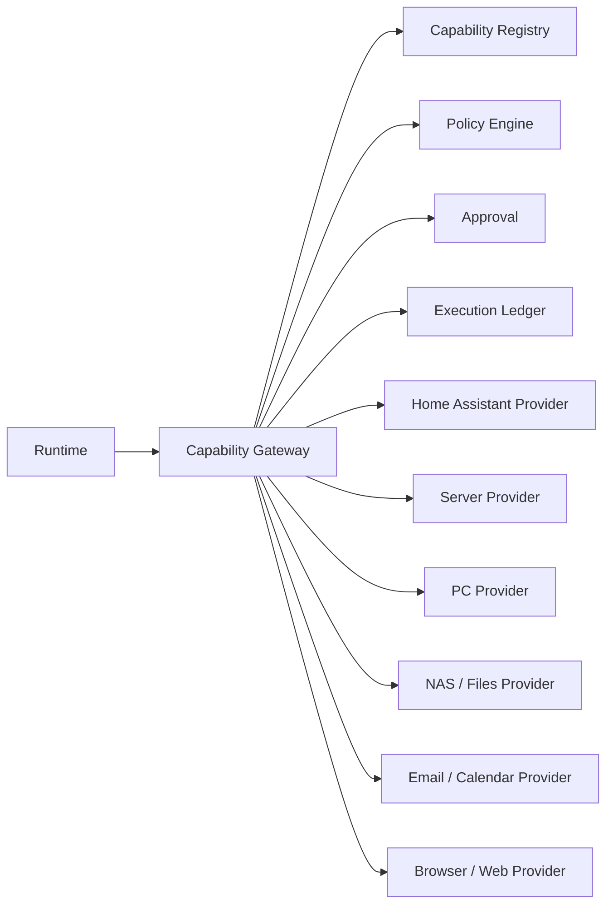
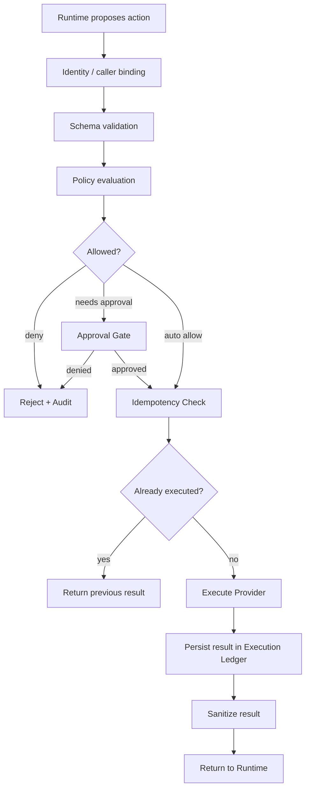
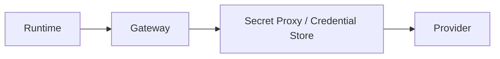
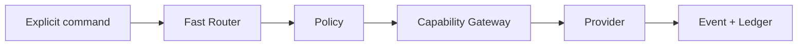

# Capability & Governance Architecture

OpenShadow separates **what a Runtime wants to do** from **what it is allowed to do**.

> **LLM proposes; Shadow decides; Capability executes.**

## 1. Capability model

A Capability is a stable, user-owned action contract.

Examples:

```text
home.light.set
home.temperature.get
calendar.search
calendar.create
email.search
email.send
server.metrics.read
server.logs.read
server.restart
nas.search
browser.fetch
```

Runtime should depend on the Capability contract, not on the concrete provider implementation.

## 2. Provider architecture



Provider implementations may change without changing the Runtime-facing capability name.

## 3. Capability Registry

Suggested fields:

```text
capability_id
version
description
input_schema
output_schema
provider_id
risk_level
permission_requirement
side_effect_class
trust_requirements
status
```

Example:

```yaml
capability_id: server.restart
version: v1
risk_level: high
permission_requirement: approval_required
side_effect_class: destructive_or_disruptive
provider_id: server-agent-local
```

## 4. Capability Gateway

All externally meaningful actions pass through the Gateway.



## 5. Risk classes

Suggested baseline:

| Class | Example | Default behavior |
| --- | --- | --- |
| Read-only | read server logs | auto if trusted |
| Reversible | change light brightness | policy-controlled |
| External commitment | send email / create meeting | approval by default |
| Destructive | delete file / restart critical service | approval required |
| Physical safety | door lock / gas / high-risk actuator | strict explicit policy |

Risk level is part of the Capability contract, not invented by each Runtime.

## 6. Idempotency

Every side-effect action receives a stable `action_id` and `idempotency_key`.

Example:

```text
task_id: task_123
action_id: action_29
idempotency_key: task_123:action_29
```

If Runtime A successfully sends an email and crashes before recording local context, Runtime B may retry the same action. The Gateway must return the original result instead of sending another email.

## 7. Execution Ledger

The Ledger is the durable authority for side effects.

Suggested fields:

```text
action_id
idempotency_key
task_id
runtime_id
capability_id
provider_id
requested_at
approved_by
approval_ref
status
started_at
completed_at
request_hash
result_ref
error
correlation_id
```

Possible statuses:

```text
PROPOSED
WAITING_APPROVAL
APPROVED
RUNNING
SUCCEEDED
FAILED
DENIED
CANCELLED
UNKNOWN_REQUIRES_RECONCILIATION
```

## 8. Unknown outcomes

Distributed systems may fail after the provider executed but before Shadow received confirmation.

For these cases:

```text
status = UNKNOWN_REQUIRES_RECONCILIATION
```

The provider adapter should define a reconciliation method where possible.

Example:

- email provider: search message by provider id / custom header;
- calendar: query event id;
- server restart: query service state;
- file creation: verify path + hash.

Never blindly retry a high-risk action with unknown outcome.

## 9. Secrets

Runtime should not receive long-lived raw secrets.

Preferred design:



The Runtime sees capability schema and sanitized results, not API keys.

## 10. Trust profiles

Policy may depend on Runtime trust level.

Example:

```yaml
runtime: local-hermes
permissions:
  private_memory: allow
  server_read: allow
  email_send: approval

runtime: cloud-specialist
permissions:
  private_memory: redact
  server_read: scoped
  email_send: deny
```

## 11. Result sanitization

Provider output may contain:

- secrets;
- private identifiers;
- huge logs;
- binary payloads;
- data outside Runtime trust scope.

Gateway should:

- persist large data as Artifact;
- redact secrets;
- return a compact structured result;
- attach evidence / artifact refs;
- retain raw provider result locally when policy allows.

## 12. Capability discovery

Runtime may ask Shadow what it can currently do.

Discovery should be filtered by:

- user identity;
- Runtime trust profile;
- Task permission profile;
- current mode;
- provider health;
- temporary restrictions.

A Runtime should not see capabilities it can never invoke if hiding them reduces risk and context noise.

## 13. Versioning

Capabilities are versioned contracts.

```text
calendar.create@v1
calendar.create@v2
```

When possible, maintain compatibility adapters rather than forcing all Runtime prompts / tools to migrate simultaneously.

## 14. Fast Path

Deterministic commands may call the Gateway without creating a General Agent task.



This is essential for low latency.

## 15. Capability vs Skill

A Capability is **real executable functionality**.

A Skill is **methodology / composition / procedure**.

Example:

```text
Capability:
server.logs.read
server.metrics.read

Skill:
"Diagnose recurring server IO spikes"
  1. inspect metrics
  2. correlate process activity
  3. inspect scheduled jobs
  4. verify storage health
```

Skills may live in Runtime or procedural memory, but stable external actions should remain capabilities.

## 16. V0.1

Minimum implementation:

- Capability Registry;
- Gateway;
- policy evaluation hook;
- approval records;
- idempotency key enforcement;
- Execution Ledger;
- artifact-backed large results;
- provider health status;
- one read-only test provider;
- one reversible / side-effect provider for idempotency tests;
- recovery / reconciliation tests.
