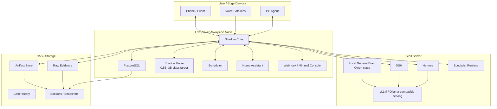
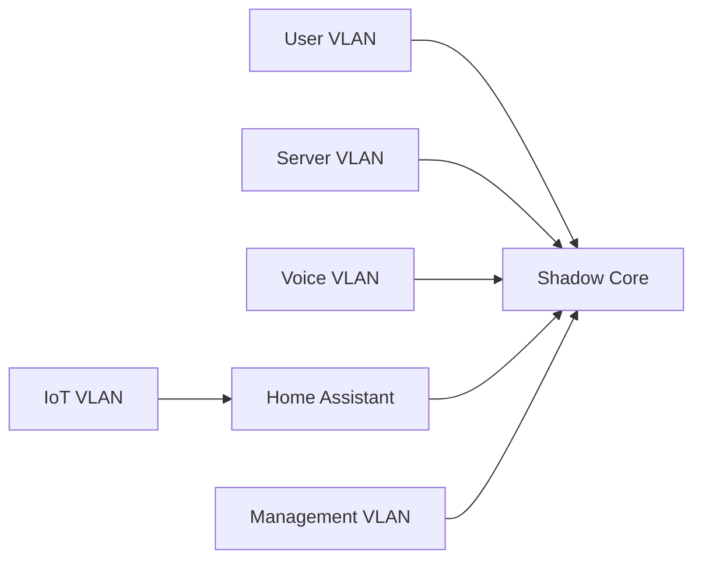
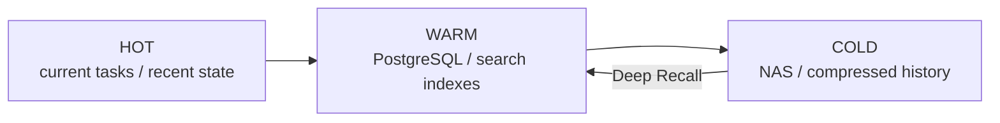

# Deployment Architecture

OpenShadow is **local-first** and should remain useful even when cloud AI providers are unavailable.

This document defines the recommended physical deployment model for a long-lived personal installation.

## 1. Deployment goals

- 7×24 low-power continuity services;
- expensive models only when needed;
- local ownership of Raw Evidence / Canonical Memory;
- physical separation of IoT / user / server trust zones;
- easy replacement of GPU server, Runtime, Memory Engine and providers;
- backup and recovery suitable for multi-year personal data.

## 2. Recommended physical topology



## 3. Low-power always-on node

This machine should host components that define continuity and need high availability but low compute.

Recommended services:

- Shadow Core;
- PostgreSQL;
- Event / World State processing;
- Scheduler;
- Shadow Pulse;
- Capability Gateway;
- Home Assistant if convenient;
- lightweight Webhook / Admin Console;
- monitoring agent.

Design principle:

> **Shadow should stay awake even when the GPU server is off.**

If the GPU server is sleeping or unavailable, the always-on node should still:

- accept events;
- update World State;
- run L0 rules;
- run Pulse if its small model fits;
- store Memory Candidates;
- maintain Tasks / schedules;
- notify the user;
- queue work for later Runtime execution.

## 4. GPU server

The GPU server hosts expensive, replaceable intelligence.

Possible workloads:

- local 20B–30B class general model;
- vLLM / other OpenAI-compatible model serving;
- Hermes;
- DeepSeek Harness;
- coding / research specialist Runtime;
- embedding or reranking batch work;
- Memory consolidation jobs when compute-heavy.

The GPU server must not be the sole storage location for durable Task / Memory / Policy state.

## 5. NAS / durable storage

Large and cold data belongs outside prompt-oriented databases.

Suggested contents:

```text
/raw-evidence/
/artifacts/
/task-history/
/imports/
/exports/
/backups/
/models/          # optional
```

PostgreSQL should store:

- metadata;
- hashes;
- provenance;
- lifecycle state;
- object references.

NAS / object storage should store the large payload.

## 6. Edge agents

### PC Agent

Possible functions:

- expose selected local files;
- report machine state;
- open applications;
- execute explicitly authorized OS actions;
- collect artifacts;
- send PC events to Shadow.

The PC Agent is a Capability Provider, not a second Shadow Core.

### Voice Satellite

A room voice node should ideally provide:

```text
local wake word
→ audio stream on demand
→ STT
→ Shadow intent / routing
→ local or remote TTS
```

Ambient raw audio should not be continuously retained by default.

### Phone / other clients

Clients are replaceable interaction surfaces. They should not own canonical memory or tasks.

## 7. Network zones

Recommended logical segmentation:

```text
User VLAN
Server VLAN
IoT VLAN
Voice / Edge VLAN
Management VLAN
```

Example trust model:



IoT devices should not receive broad access to user / server networks.

## 8. Secrets

Secrets should be centralized or proxied.

Candidates:

- OS keyring / encrypted local store for V0.1;
- Vault-like secret manager later.

Rules:

- Runtime does not receive raw long-lived secrets when avoidable;
- Provider adapters authenticate on behalf of Runtime;
- logs must redact secrets;
- backup of secrets must be encrypted separately;
- cloud Runtime trust profile controls which provider actions it can request.

## 9. Containers and process model

V0.1 should prefer **Docker Compose** or ordinary supervised processes.

Suggested containers / services:

```text
shadow-core
postgres
pulse-runtime          # optional separate process
home-assistant         # optional / existing install
local-model-server     # on GPU host
hermes-runtime         # on GPU host
 dsh-runtime           # on GPU host
```

Do not introduce Kubernetes until there is a real operational need.

## 10. Storage tiering



### Hot

- active Task Working Memory;
- World State;
- recent events;
- approval / action state.

### Warm

- Canonical Memory;
- task history metadata;
- searchable recent evidence;
- derived indexes.

### Cold

- old raw logs;
- historical sensor series;
- large completed-task artifacts;
- archived conversation / email exports where appropriate.

## 11. Backup model

Long-lived continuity makes backups a core requirement.

At minimum back up:

- PostgreSQL;
- Raw Evidence metadata and content;
- Artifact Store;
- canonical configuration;
- Policy;
- encryption / credential recovery material using a secure separate process.

Recommended strategy:

```text
local snapshots
+ offline / second-device copy
+ optional encrypted off-site copy
```

Indexes and model caches do not need the same backup priority because they can be rebuilt.

## 12. Restore test

A backup is not valid until restore is tested.

OpenShadow should eventually support a restore verification routine:

1. start clean Shadow instance;
2. restore PostgreSQL;
3. restore Raw Evidence / Artifact Store;
4. rebuild derived indexes;
5. verify Task / Memory / Policy integrity;
6. attach a different Runtime;
7. resume a historical test Task.

This is a direct test of continuity.

## 13. Observability

V0.1 operational data should include:

- Core health;
- PostgreSQL health;
- event ingestion rate;
- Pulse latency / escalation rate;
- task queue / waiting tasks;
- Runtime health;
- provider health;
- Capability error rate;
- execution-ledger unknown outcomes;
- disk usage;
- backup status.

Prometheus / Grafana can be added later; structured logs and a minimal health API are enough initially.

## 14. Degraded modes

### GPU server down

Shadow continues event/state/task/scheduler/Pulse operations and queues expensive tasks.

### Internet down

Local Runtime / HA / PC / NAS functions continue. Cloud-only capabilities become unavailable.

### PostgreSQL down

Durable writes must fail closed for state-changing operations; Runtime must not continue pretending durable checkpoints or side effects were recorded.

### Memory engine down

Canonical Memory remains intact. Retrieval can degrade to structured / lexical lookup or no-memory mode.

### Runtime down

Task enters recovery / waiting; Shadow may choose fallback Runtime.

## 15. V0.1 deployment

Minimum practical deployment:

```text
One always-on Linux node:
  Shadow Core
  PostgreSQL
  Scheduler
  L0 rules
  Pulse adapter

One optional GPU machine:
  local model server
  Hermes
  DSH

Local filesystem / NAS:
  Raw Evidence
  Artifacts
```

This is sufficient to validate the architecture before introducing more infrastructure.
