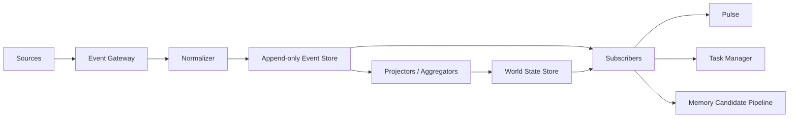
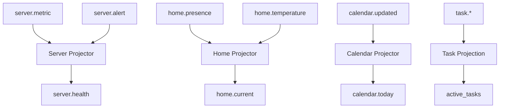
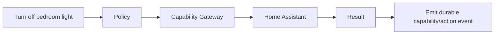
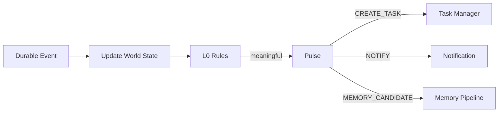

# Event & World State Architecture

OpenShadow separates **what happened** from **what is true now**.

> Event = what happened.  
> World State = the current projection used for decisions.

## 1. Why this separation exists

A long-lived personal AI cannot afford to re-read its entire history whenever something changes.

Examples:

- thousands of Home Assistant sensor updates;
- repeated server metrics;
- email and calendar changes;
- runtime lifecycle events;
- task progress updates.

OpenShadow therefore keeps an append-oriented history while maintaining compact current projections.

## 2. Event pipeline



Typical sources:

- Chat / Voice clients;
- Email / Calendar;
- Home Assistant;
- PC Agent;
- Server Agent;
- NAS / Files;
- Scheduler;
- Runtime lifecycle;
- Capability Gateway;
- Memory subsystem.

## 3. Event Gateway

The Event Gateway is responsible for ingress normalization, not reasoning.

Responsibilities:

- authenticate source;
- validate event schema;
- assign stable `event_id`;
- normalize timestamps;
- attach source / actor identity;
- attach privacy / retention metadata;
- deduplicate obvious retries when possible;
- store the event durably before downstream asynchronous work.

## 4. Event contract

Minimum conceptual shape:

```json
{
  "event_id": "evt_01...",
  "type": "server.disk.threshold_crossed",
  "occurred_at": "2026-08-19T01:15:00+08:00",
  "received_at": "2026-08-19T01:15:00.120+08:00",
  "source": "server-agent:gpu-01",
  "actor": "system",
  "payload": {},
  "artifact_refs": [],
  "privacy_level": "private",
  "schema_version": 1,
  "correlation_id": "corr_...",
  "causation_id": "evt_..."
}
```

Important semantics:

- `occurred_at` = when the real-world event happened;
- `received_at` = when Shadow received it;
- `correlation_id` = groups a larger flow;
- `causation_id` = points to the event that caused this event when known.

## 5. Append-only and corrections

Events should not be silently rewritten once accepted.

Corrections are modeled as new facts:

```text
original_event
      ↓
correction / superseding event
```

This keeps audit and replay possible.

## 6. State projection

World State is built by deterministic or explicitly versioned projectors.



World State examples:

```yaml
user:
  mode: sleep
  location_scope: home
home:
  presence:
    bedroom: true
  temperature:
    bedroom: 25.4
server:
  gpu-01:
    status: degraded
    disk_usage: 0.94
calendar:
  next_event:
    starts_at: "2026-08-19T08:30:00+08:00"
active_tasks:
  - task_id: task_123
    status: waiting
```

## 7. Compact state views

Different consumers should receive different projections.

Examples:

- Pulse view: compact risk / attention fields;
- Runtime view: task-relevant current state;
- Web Console view: operational summary;
- Capability Provider view: only state needed for action.

A consumer should not need to query the entire `world_state` object if a smaller view is sufficient.

## 8. Event Bus semantics

V0.1 can use an in-process asynchronous event dispatcher plus PostgreSQL persistence.

Do not introduce Kafka / NATS / distributed streaming merely for architectural aesthetics.

Suggested V0.1 pattern:

```text
write Event row transactionally
        ↓
publish in-process notification
        ↓
subscribers process
        ↓
periodic recovery worker finds unprocessed durable events
```

Later, the internal bus can be replaced without changing Event Contract semantics.

## 9. Fast synchronous commands and asynchronous facts

Not every request must synchronously traverse an Event Bus before executing.

Example Fast Path:



The command path remains fast while Shadow still records what happened.

For high-risk actions, the execution ledger remains authoritative for side-effect status.

## 10. Event-to-attention path



This is how Shadow can act without a conversational prompt.

## 11. Noise management

Long-lived event streams become unusable without aggregation.

Required strategies:

- debounce;
- deduplication;
- aggregation windows;
- threshold-crossing events instead of raw polling where possible;
- state-change events instead of identical-state repetition;
- retention tiering;
- raw sensor/event compaction for cold history.

Example:

```text
1000 temperature samples
        ↓
raw / cold evidence retained if configured
        ↓
World State keeps latest value
        ↓
Pulse receives only meaningful delta / anomaly event
```

## 12. Replay and rebuild

Projectors must be versioned so World State can be rebuilt from Event Store when logic changes.

```text
Event Store
   ↓ replay with projector v2
New World State projection
   ↓ validate
Promote projection version
```

This is important for long-lived upgradeability.

## 13. Event vs Memory

Events and Memory solve different problems:

| Event | Memory |
| --- | --- |
| immutable-ish fact record | revisable interpretation |
| what happened | what it means / what may matter later |
| high volume | selected / consolidated |
| replay source | decision context |
| timestamp + source | validity + confidence + provenance |

Not every Event becomes Memory.

## 14. V0.1 requirements

V0.1 should implement:

- stable Event Contract;
- PostgreSQL append-only Event Store;
- Event Gateway / Normalizer;
- basic correlation / causation ids;
- World State projector interface;
- projectors for task, server test events, scheduler and runtime lifecycle;
- replay test;
- event recovery worker;
- basic debounce / deduplication;
- Pulse subscription to relevant event classes.

No distributed event platform is required for V0.1.
