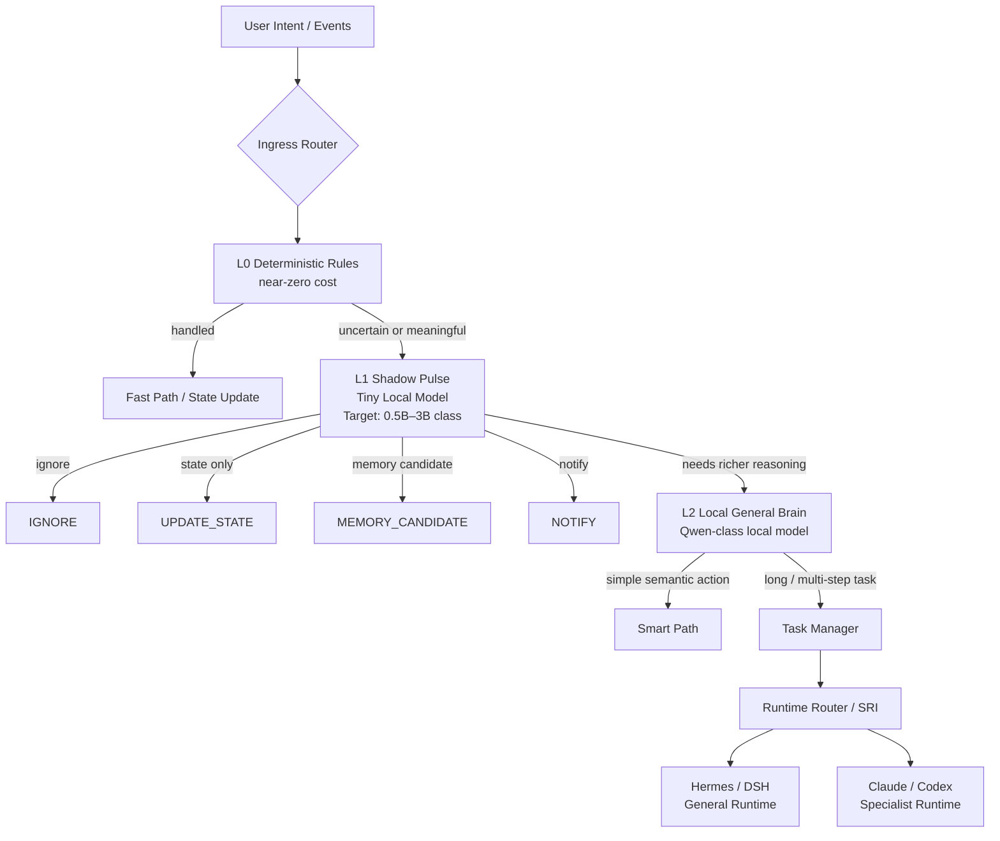
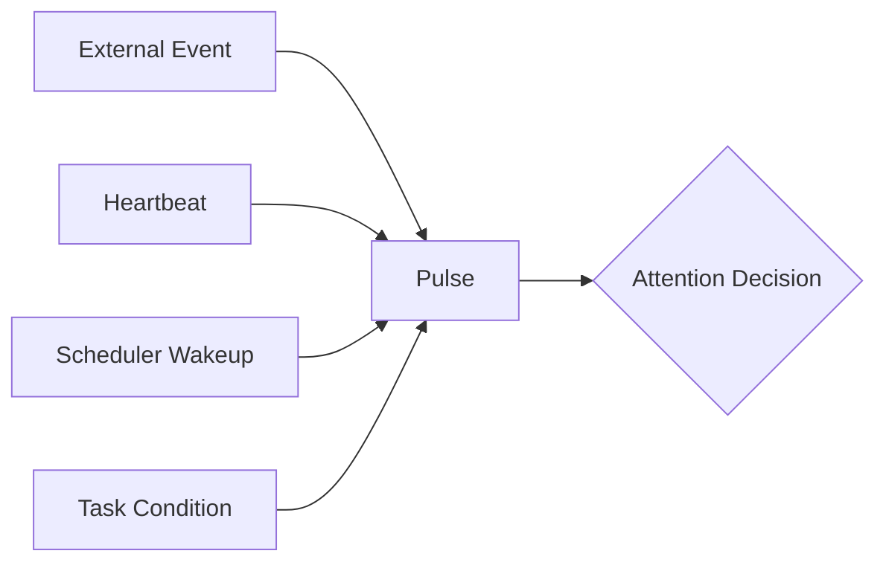
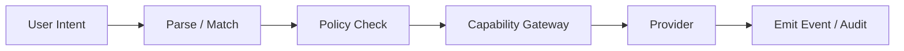
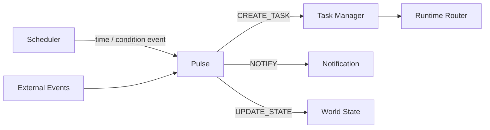

# Intelligence Plane & Shadow Pulse

This document defines how OpenShadow stays **always available without keeping a large Agent Runtime continuously active**.

> The core rule is simple: **the more expensive the intelligence, the later it enters the path.**

## 1. Goals

The Intelligence Plane must satisfy four goals:

1. **7×24 awareness** without running a large model or full Agent loop continuously.
2. **Fast deterministic actions** should not pay Agent latency or token cost.
3. **Escalation by necessity**: use larger intelligence only when smaller layers cannot safely decide.
4. **Runtime neutrality**: Hermes / DSH / Claude / future runtimes remain replaceable executors.

## 2. Layered intelligence model



### L0 — Deterministic Rules

Responsibilities:

- hard thresholds and safety rules;
- direct intent patterns;
- cheap deduplication / debounce;
- known Fast Path commands;
- event suppression;
- state projection triggers.

Examples:

- `disk_usage < 80%` → no Agent action;
- repeated identical sensor event within debounce window → drop / merge;
- explicit `light.off(room=bedroom)` with valid permission → Fast Path;
- destructive action → never execute without approval regardless of model suggestion.

L0 should be implemented as ordinary code, not an LLM.

## 3. L1 — Shadow Pulse

Shadow Pulse is the **always-on Personal Attention Layer**.

It is not a full Agent, not a cron job, and not a large-model heartbeat.

### 3.1 Target operating profile

V0.1 design target:

- local-first;
- always available;
- model class target: **0.5B–3B** or equivalent small classifier/router;
- low-memory / low-power footprint;
- short structured input;
- structured decision output;
- no unrestricted tool loop;
- no full-history prompt.

The exact model is replaceable. The architectural requirement is the **small-model role**, not a specific checkpoint.

### 3.2 Pulse input

Pulse receives a compact attention packet rather than the user’s entire history:

```text
recent_events
+ compact_world_state
+ active_task_summary
+ current_mode
+ attention_policy
+ event_source_trust
+ urgency / risk metadata
```

Pulse should **not** automatically receive:

- full conversation history;
- all Canonical Memory;
- complete email archive;
- raw sensor history;
- large task artifacts.

If additional context is required, Pulse should escalate instead of silently expanding context.

### 3.3 Pulse output contract

V0.1 output vocabulary:

```text
IGNORE
UPDATE_STATE
MEMORY_CANDIDATE
NOTIFY
CREATE_TASK
ESCALATE
```

Recommended structured output:

```json
{
  "decision": "CREATE_TASK",
  "reason_code": "SERVER_STORAGE_CRITICAL",
  "confidence": 0.94,
  "urgency": "high",
  "suggested_task_intent": "diagnose_storage_growth",
  "required_context": ["server.health", "recent.backup_jobs"]
}
```

The free-form explanation is optional; machine-readable fields are authoritative.

## 4. How Pulse wakes up

Pulse is **event-driven first**.



Wakeup sources:

### Event-driven

Preferred path for:

- server alerts;
- email arrival;
- calendar changes;
- Home Assistant events;
- PC / NAS events;
- task / runtime lifecycle events.

### Heartbeat

Heartbeat exists only for conditions that do not naturally emit events or require periodic reconciliation.

Examples:

- verify stale tasks;
- reconcile missed provider events;
- re-evaluate long-lived conditions;
- compact / housekeeping checks.

**Heartbeat must not mean “ask a large Agent every N minutes whether anything needs doing.”**

### Scheduled wakeup

Explicit scheduled work should normally produce a scheduler event, then go through the same policy / task path as other events.

### Task condition wakeup

A waiting Task may define a condition such as:

- retry after a cooldown;
- resume when a file appears;
- resume when a server becomes healthy;
- resume when approval is granted.

## 5. Four execution paths

### 5.1 Fast Path

Use when intent and action are deterministic.



Examples:

- turn off a light;
- query current temperature;
- fetch known server metric;
- acknowledge a notification.

No General Runtime is required.

### 5.2 Smart Path

Use a small / local semantic model when natural language must be interpreted but planning is unnecessary.

Example:

> “把卧室调成睡觉模式。”

Possible structured result:

```text
home.lights.off(bedroom)
home.curtain.close(bedroom)
home.temperature.apply_profile(sleep)
```

The Capability Gateway still decides what is allowed.

### 5.3 Agent Path

Use for multi-step reasoning, investigation, planning, or multi-tool tasks.

Examples:

- investigate server instability;
- prepare a research brief;
- triage a complex inbox;
- plan a multi-stage workflow.

This path creates or resumes a Shadow Task and delegates execution through SRI.

### 5.4 Specialist Path

Use a domain-specific Runtime when specialization materially helps.

Examples:

- coding / repository repair → Claude / Codex;
- deep research → research specialist;
- security / ops task → specialized Runtime.

The specialist still receives Shadow-owned Task / Memory / Policy / Capability context.

## 6. Escalation policy

A lower layer escalates when one or more conditions hold:

- insufficient confidence;
- multi-step reasoning required;
- ambiguous intent with meaningful consequence;
- cross-domain context required;
- large evidence inspection required;
- high-risk action requires a richer plan;
- user explicitly requests deep analysis.

Escalation should be monotonic for a single decision path:

```text
L0 → L1 → L2 → L3
```

A request may stop at any level.

## 7. Scheduler, Pulse, and Task are different

These three components answer different questions:

| Component | Question |
| --- | --- |
| Scheduler | **When should something be checked or resumed?** |
| Pulse | **Does this situation deserve attention now?** |
| Task Manager | **What durable work must continue until completion?** |



## 8. Failure behavior

Pulse failure must not block deterministic safety rules.

- L0 safety / deny rules remain available.
- Events remain durably stored.
- Pulse decisions can be replayed from Event Store.
- If L1 is unavailable, configured critical rules may directly create a Task or notify the user.
- Pulse must never be the only storage location for attention state.

## 9. Metrics

Recommended operational metrics:

- events seen per day;
- L0 filtered ratio;
- Pulse decisions per day;
- escalation rate L1→L2 / L2→L3;
- useful notification rate;
- false-positive attention rate;
- missed-critical-event count;
- average decision latency;
- local compute / token cost;
- percentage of requests completed without General Runtime.

A healthy Shadow should process **many events with very few expensive escalations**.

## 10. V0.1 scope

V0.1 does not require training a new Pulse model.

Minimum implementation:

1. deterministic L0 rules;
2. a pluggable small-model Pulse interface;
3. structured Pulse decision schema;
4. event-driven wakeup;
5. periodic reconciliation heartbeat;
6. Task creation / notification / state update actions;
7. metrics for escalation and false positives.

The initial Pulse may use a small local instruction model or even a rules + classifier hybrid. The important architecture property is that **the always-on layer remains small and replaceable**.
