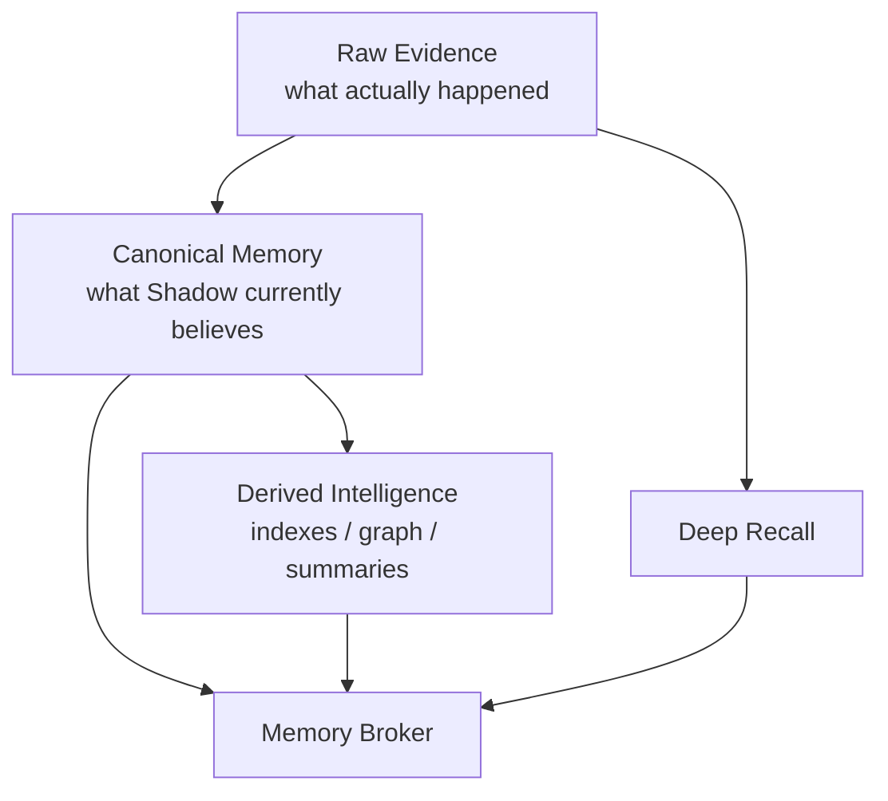
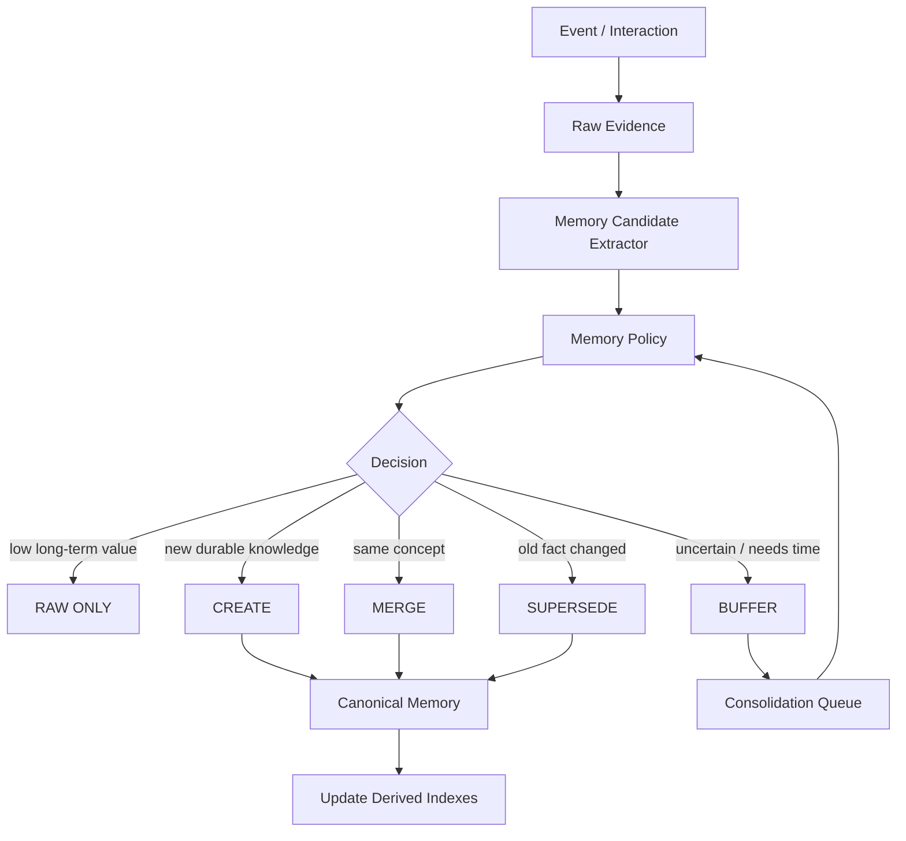
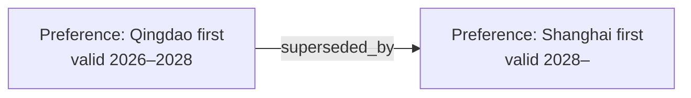
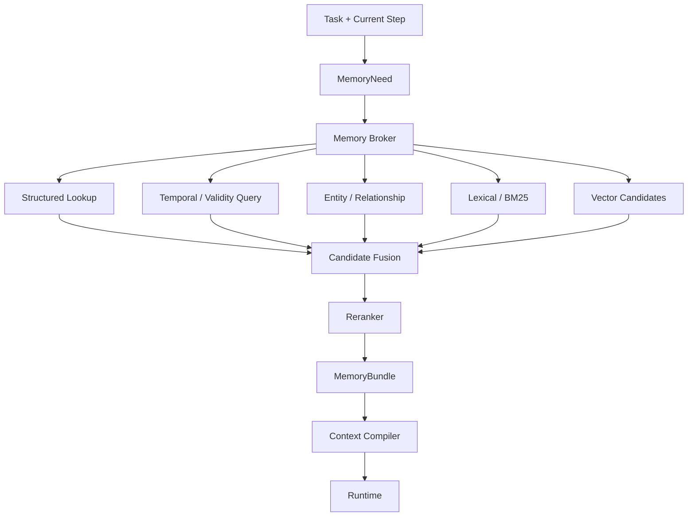
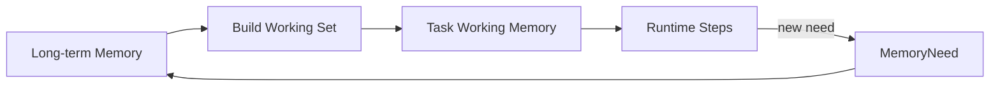
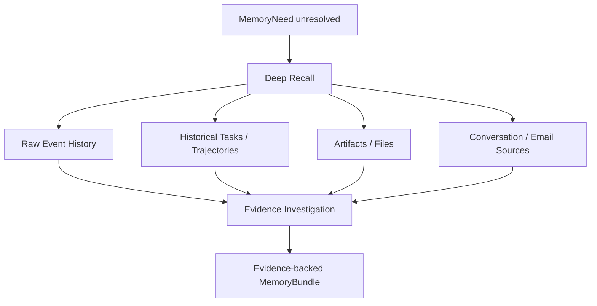

# Memory Architecture

OpenShadow Memory is a **decision-support substrate**, not a generic long-term RAG system.

> Memory exists to improve the next decision, not to maximize historical recall.

## 1. Core principles

1. **Raw Evidence is the durable truth source.**
2. **Canonical Memory is interpretation, not immutable truth.**
3. **Derived indexes are disposable and rebuildable.**
4. **Retrieval is a decision, not a vector-database query.**
5. **A Runtime receives a task-relevant working set, not the user’s entire memory.**
6. **Failure to promote an event into Memory must not destroy the original evidence.**

## 2. Memory layers



### Layer 1 — Raw Evidence

Examples:

- conversation turns;
- email messages;
- calendar events;
- provider / tool results;
- task trajectories;
- server / device events;
- documents, reports, files;
- user corrections and approvals.

Properties:

- append-oriented;
- provenance-preserving;
- independently addressable;
- retained even if current interpretation changes;
- large payloads may live in NAS / Artifact Store with hashes and references in PostgreSQL.

### Layer 2 — Canonical Memory

Canonical Memory is a structured, revisable interpretation of evidence.

Typical memory types:

- semantic fact;
- preference;
- relationship;
- episodic memory;
- decision;
- project state;
- procedure;
- constraint;
- policy-relevant user preference.

Minimum fields:

```text
memory_id
memory_type
subject / entity / scope
content
valid_from
valid_to
confidence
importance
source_event_ids
source_artifact_refs
supersedes
created_at
updated_at
privacy_level
```

### Layer 3 — Derived Intelligence

Examples:

- embeddings;
- pgvector index;
- BM25 / FTS index;
- graph projection;
- summaries;
- user profile views;
- reranker features;
- cached MemoryBundle.

These are **not sources of truth** and may be rebuilt when engines or models change.

## 3. Write path — from experience to memory



### 3.1 Memory Candidate Extractor

The extractor proposes candidate information such as:

```text
candidate_type
subject / entity
claim
source_refs
observed_time
explicitness
confidence
```

It does **not** have authority to make the candidate permanent.

### 3.2 Memory Policy

Memory Policy decides whether the candidate deserves promotion.

V0.1 factors:

```text
future usefulness
+ decision impact
+ user explicitness
+ novelty
+ stability
+ entity importance
+ repetition / corroboration
+ source quality
- redundancy
- uncertainty
- privacy / retention risk
```

Possible outcomes:

- `RAW_ONLY`
- `BUFFER`
- `CREATE`
- `MERGE`
- `SUPERSEDE`
- `REJECT`

### 3.3 Buffer and consolidation

OpenShadow should avoid immediate over-interpretation.

Example:

```text
Day 1: user chooses A
Day 10: user chooses A again
Day 30: user explicitly says A is preferred
        ↓
Consolidation
        ↓
Canonical preference: prefers A
```

The buffer lets Shadow accumulate evidence before creating a strong long-term belief.

## 4. Time and supersession

Personal facts and preferences change.

Do not overwrite history silently.



Queries must be able to ask both:

- **What is currently true?**
- **What did Shadow believe at time T, and why?**

## 5. Read path — task-aware recall



### 5.1 MemoryNeed

A Runtime or Context Compiler should request **what kind of memory is needed**, rather than issuing only a free-form semantic query.

Example:

```yaml
need_type:
  - preference
  - decision
entities:
  - user
  - project:shadow
time_scope: current
importance: required
budget_tokens: 800
purpose: choose_runtime_for_current_task
```

### 5.2 Retrieval priority

Preferred order:

1. direct structured lookup;
2. temporal validity query;
3. entity / relationship lookup;
4. lexical / BM25 search;
5. vector semantic candidate generation.

Vector similarity is one signal, never the authority.

### 5.3 Reranking signals

Suggested signals:

- task relevance;
- current-step relevance;
- exact entity match;
- temporal validity;
- confidence;
- importance;
- source quality;
- recency when appropriate;
- historical usefulness;
- redundancy penalty;
- privacy / trust compatibility with target Runtime.

## 6. MemoryBundle

A Runtime should normally receive a **compiled MemoryBundle**, not a bag of raw chunks.

Example:

```text
Relevant constraints
- Cloud Runtime may not receive private health records.
- This Task may use server.read but requires approval for server.restart.

Relevant current preferences
- Prefer local execution when quality is sufficient.

Relevant project state
- Runtime continuity is a hard architectural requirement.
- DSH is currently a candidate Runtime, not the source of truth.

Relevant precedent
- Previous similar task failed because action result was not persisted before Runtime crash.
```

Each item retains hidden / machine-readable provenance refs even if the Runtime-facing representation is concise.

## 7. Task Working Memory

A long task should not re-query long-term memory on every step.



Task Working Memory contains:

- current known facts;
- task-specific constraints;
- decisions;
- artifacts;
- relevant personal memory;
- unresolved questions;
- provider results.

This is durable Task state and can survive Runtime handoff.

## 8. Deep Recall

Canonical Memory is intentionally compressed and may be incomplete.

When confidence is low or a task needs historical detail, Shadow can perform **Deep Recall** against source history.



Deep Recall is slower and more expensive, but avoids forcing every useful detail into permanent Canonical Memory.

## 9. Push and pull memory

Memory can reach a Runtime in two ways.

### Pull

The Runtime / Context Compiler explicitly requests missing context using `MemoryNeed`.

### Push

Shadow injects a small set of mandatory context when policy or task semantics require it.

Examples:

- privacy restriction before a Cloud Runtime is invoked;
- current location constraint when planning travel;
- hard user preference relevant to a purchasing decision.

Push must be conservative.

Decision rule:

> **Would removing this memory plausibly change the next action?**

If not, do not inject it by default.

## 10. Memory feedback loop

Every retrieval should create feedback signals:

```text
retrieved
injected
referenced_by_runtime
changed_decision
ignored
user_corrected
contributed_to_success
contributed_to_failure
```

These signals may later train or calibrate a **Personal Memory Router**.

Possible future router output:

```text
IGNORE
INJECT
RETRIEVE
DEEP_RECALL
```

## 11. Replaceable memory engines

OpenShadow owns the contract and canonical state; engines are replaceable.

Possible providers:

- Mem0;
- LangMem;
- Graphiti;
- future memory engines.

Provider responsibilities may include:

- candidate extraction;
- indexing;
- graph construction;
- candidate search;
- reranking.

Provider output must resolve back to Shadow-owned memory / evidence identifiers.

## 12. V0.1 implementation

V0.1 should remain intentionally simple:

- PostgreSQL for Raw Evidence metadata and Canonical Memory;
- PostgreSQL FTS / BM25-like lexical retrieval where practical;
- pgvector for semantic candidates;
- rule + LLM Memory Policy;
- no mandatory graph database;
- simple `MemoryNeed` schema;
- simple candidate fusion and reranking;
- explicit provenance;
- Task Working Memory;
- Deep Recall against Event / Artifact history.

The goal is to validate **memory usefulness**, not to build a new memory database.

## 13. Evaluation

Compare at least:

- no memory;
- full recent history;
- vector Top-K;
- external engine baseline such as Mem0 / MemOS where available;
- Shadow task-aware policy.

Metrics:

- task success;
- decision quality;
- irrelevant context ratio;
- token / latency cost;
- memory precision;
- stale-memory error rate;
- user correction rate;
- useful recall rate;
- Deep Recall success rate.
