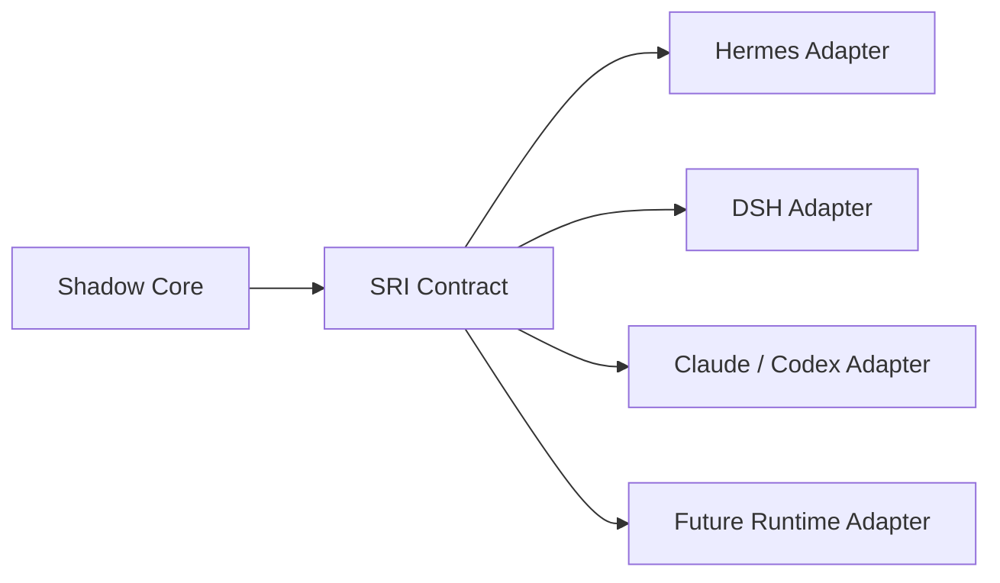
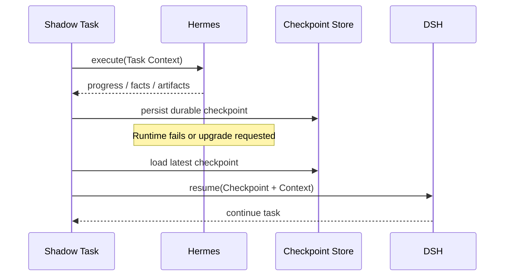
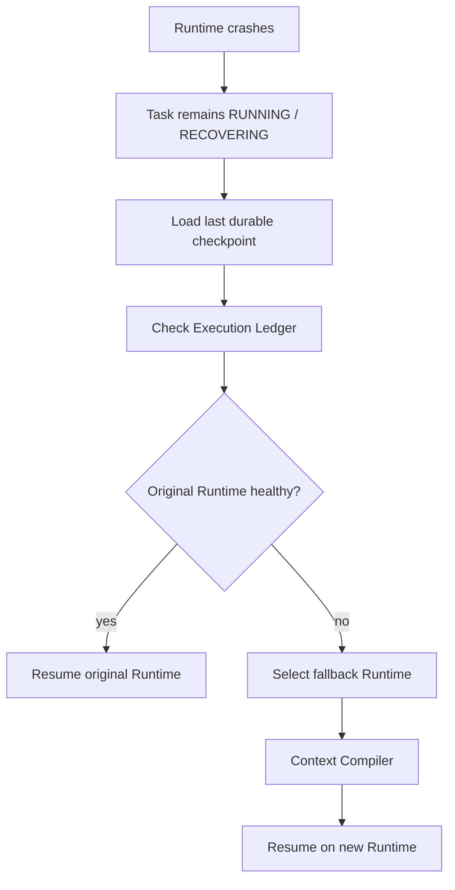
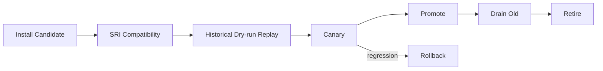
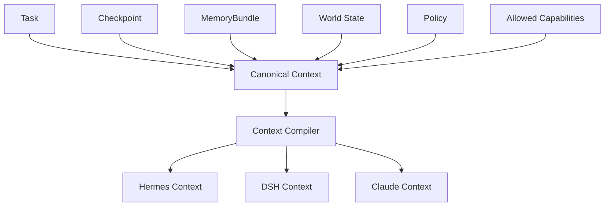

# Runtime Architecture & Continuity

OpenShadow treats Agent Runtime as a **replaceable execution engine**.

> Runtime owns reasoning and temporary execution state. Shadow owns durable continuity.

## 1. Runtime role

A Runtime may provide:

- Agent loop;
- planning;
- tool-use orchestration;
- runtime-local session;
- subagents;
- model adapters;
- temporary context;
- runtime-specific compaction.

A Runtime must not be the authoritative source for:

- durable Task state;
- Canonical Memory;
- user Policy;
- Capability ownership;
- long-lived schedules;
- side-effect ledger;
- long-term user identity.

## 2. Shadow Runtime Interface (SRI)

SRI is the stable boundary between Shadow and Runtime implementations.

```text
execute(task_context)
resume(semantic_checkpoint)
pause(task_id)
cancel(task_id)
checkpoint(task_id)
status(task_id)
capabilities()
health()
```

The exact transport is replaceable. V0.1 may use HTTP / JSON-RPC / subprocess IPC depending on Runtime capabilities.

## 3. Runtime adapter pattern



Adapters are responsible for translating:

- Task context into Runtime input;
- Runtime status into Shadow status;
- checkpoint requests;
- runtime events;
- cancellation / interruption;
- tool / capability surface exposure.

Adapters must not redefine Shadow Task semantics.

## 4. Runtime Registry

Suggested registry fields:

```text
runtime_id
runtime_type
version
sri_version
endpoint / launch_spec
trust_profile
capabilities
supported_modalities
health_status
status: candidate | canary | stable | deprecated
resource_profile
last_seen_at
```

The Registry allows multiple Runtime versions to coexist.

## 5. Runtime selection

Runtime Router should consider:

- task intent;
- required capabilities;
- specialist suitability;
- privacy / trust requirements;
- latency budget;
- cost budget;
- local resource availability;
- runtime health;
- user policy;
- historical task success.

Example:

```text
simple local reasoning → Local Brain
complex general task   → Hermes / DSH
coding repository task → Claude / Codex
privacy-sensitive task → trusted local Runtime only
```

## 6. Semantic handoff

OpenShadow does **not** attempt to migrate hidden reasoning or runtime-private object graphs.

It migrates a durable semantic checkpoint.



What must survive:

- goal;
- current stage;
- completed steps;
- known facts;
- decisions and evidence;
- tool results;
- artifact refs;
- open questions;
- remaining work;
- next objective;
- executed side-effect status.

What does not need to survive:

- hidden chain-of-thought;
- token-level KV state;
- runtime-internal planner graph;
- private subagent handles;
- implementation-specific session objects.

## 7. Runtime-local Session

Runtime sessions are useful but non-canonical.

```text
Shadow Task task_123
├─ Runtime Binding
│  ├─ runtime_id = hermes-v1
│  └─ runtime_session_ref = h_session_98
│
├─ later binding
│  ├─ runtime_id = dsh-v2
│  └─ runtime_session_ref = d_session_42
│
└─ Canonical Task / Checkpoint remain unchanged
```

Runtime session transcripts may be retained as Raw Evidence.

## 8. Checkpoint policy

Checkpoint frequency depends on risk and task duration.

Trigger examples:

- after a meaningful stage completes;
- after expensive evidence collection;
- before high-risk action proposal;
- after side-effect completion;
- before Runtime upgrade / shutdown;
- periodic interval for long-running work;
- explicit Runtime request.

Checkpointing every model token is unnecessary. Checkpointing only at task completion is insufficient.

## 9. Crash recovery



Recovery must reconcile side effects before continuing.

## 10. Runtime upgrade lifecycle



### Historical replay

Use Shadow-owned historical tasks as evaluation material.

Replay must suppress or sandbox external side effects.

Compare:

- task success;
- tool errors;
- latency;
- token / cost;
- intervention rate;
- policy violations;
- recovery behavior;
- context size.

### Canary

Example rollout:

```text
5% → 10% → 30% → 50% → 100%
```

Routing weights belong to Shadow, not the candidate Runtime.

### Drain

Default safest strategy:

- old Runtime stops receiving new Tasks;
- existing Tasks finish on old Runtime;
- new Tasks go to candidate/stable Runtime.

Long-running tasks may use Semantic Handoff when justified.

## 11. Context hydration

Runtime switch works because Runtime-specific context is generated from Shadow-owned state.



This is conceptually similar to a compiler IR: stable semantic state, multiple backend-specific representations.

## 12. Trust profiles

Each Runtime should have a trust profile.

Example:

```yaml
runtime: cloud-claude
trust:
  allow_private_memory: false
  allow_health_data: false
  allow_raw_secrets: false
  allow_external_network: true
  require_redaction: true
```

Context Compiler and Capability Gateway enforce the profile.

## 13. Runtime capability discovery

`capabilities()` should report execution features such as:

- supports_checkpoint;
- supports_interrupt;
- supports_streaming;
- supports_subagents;
- supports_browser;
- supports_shell;
- max_context;
- supported_models;
- supported_tool_transport.

Shadow uses this for routing and compatibility checks.

## 14. V0.1

V0.1 should prove Runtime neutrality with at least two distinct Runtime adapters.

Minimum:

- SRI contract;
- Runtime Registry;
- Hermes Adapter;
- DSH Adapter;
- basic Runtime Router;
- semantic checkpoint persistence;
- crash/fallback flow;
- runtime-local session refs;
- historical replay harness;
- simple canary weights;
- trust profile enforcement hooks.

The goal is not to normalize every possible Agent feature. The goal is to preserve **task continuity across execution engines**.
