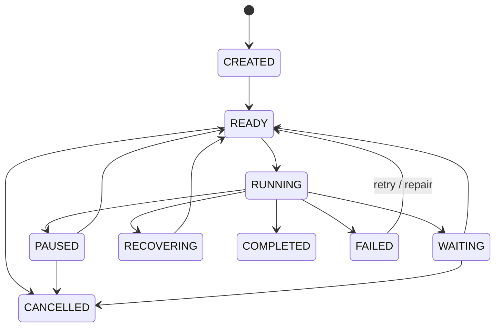
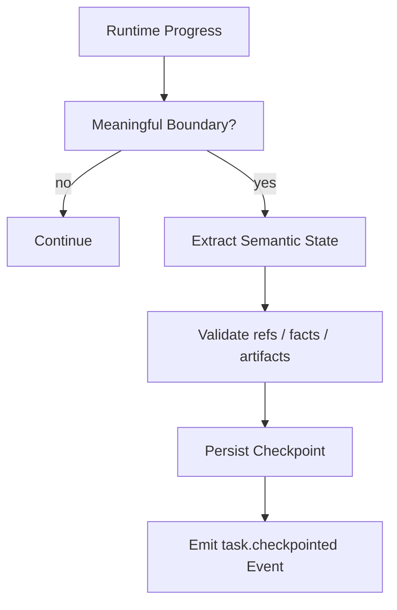
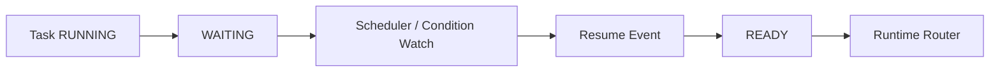

# Task & Semantic Checkpoint Architecture

OpenShadow treats Task as a durable, first-class object independent of any Runtime session.

> Runtime executes a Task. Runtime does not own the Task.

## 1. Why Task belongs to Shadow

A long-lived personal AI must survive:

- Runtime restart;
- model switch;
- Agent framework upgrade;
- machine reboot;
- human interruption;
- multi-hour or multi-day waiting;
- handoff between general and specialist agents.

If the Task only exists inside a Runtime session, continuity is lost when the Runtime disappears.

## 2. Canonical Task model

Minimum conceptual structure:

```yaml
task_id: task_123
user_id: user_1
goal: diagnose server IO spikes
intent: server_diagnosis
status: RUNNING
priority: normal
deadline: null
current_stage: correlate backup jobs with IO spikes
completed_steps:
  - inspect_cpu
  - inspect_memory
  - inspect_disk_health
known_facts:
  - nvme0 SMART healthy
  - postgres fsync spikes correlate with backup window
decisions:
  - backup job is primary hypothesis
artifact_refs:
  - artifact://task_123/journal.log
remaining_work:
  - inspect backup-job configuration
  - propose safe mitigation
allowed_capabilities:
  - server.metrics.read
  - server.logs.read
permission_profile: ops-readonly
runtime_binding:
  runtime_id: hermes-v1
  runtime_session_ref: h_998
checkpoint_ref: checkpoint_12
```

## 3. Task state machine



Suggested meanings:

- `CREATED`: accepted but not yet routable;
- `READY`: all prerequisites satisfied;
- `RUNNING`: bound to a Runtime / active executor;
- `WAITING`: waiting for time, external condition, approval, or user input;
- `PAUSED`: intentionally suspended;
- `RECOVERING`: reconciling after Runtime failure;
- `COMPLETED`: durable goal accepted as complete;
- `FAILED`: cannot proceed under current plan / constraints;
- `CANCELLED`: intentionally terminated.

## 4. Task creation sources

A Task may be created by:

- explicit user request;
- Pulse decision;
- Scheduler;
- Runtime subtask promotion;
- recurring automation;
- recovery / repair workflow;
- system maintenance policy.

Every creation must be represented by durable events.

## 5. Semantic Checkpoint

A Semantic Checkpoint records the **externally meaningful task state** needed to continue work.

```yaml
checkpoint_id: chk_12
task_id: task_123
created_at: ...
current_stage: inspect backup job
completed_work:
  - CPU checked
  - memory checked
  - SMART checked
known_facts:
  - postgres fsync spike correlates with backup window
decisions:
  - backup job is strongest current hypothesis
evidence_refs:
  - artifact://task_123/docker-stats.json
  - artifact://task_123/journal.log
open_questions:
  - is backup cadence misconfigured?
remaining_work:
  - inspect job config
  - estimate safe change
next_objective: inspect backup-job configuration
execution_ledger_cursor: action_29
```

## 6. What checkpointing excludes

Do not attempt to persist or transfer:

- hidden chain-of-thought;
- token-by-token hidden state;
- KV cache;
- runtime-private planner objects;
- undocumented internal handles.

This avoids impossible or brittle migrations.

## 7. Checkpoint creation



Good checkpoint boundaries:

- stage completed;
- important evidence collected;
- before long wait;
- after external side effect;
- before planned Runtime handoff;
- periodically during expensive long tasks.

## 8. Task Working Memory

Task Working Memory is a durable working set optimized for the current Task.

Contains:

- relevant long-term memory;
- current facts;
- constraints;
- artifacts;
- decisions;
- unresolved questions;
- provider results;
- local task notes.

It reduces repeated long-term Memory retrieval while remaining independent of Runtime-private prompt state.

## 9. Waiting tasks

A Task may wait on:

```text
approval
user input
scheduled time
external webhook/event
provider recovery
file arrival
resource availability
cooldown
```

Waiting must not require a Runtime process to remain alive.



## 10. Subtasks

Runtimes may have native subagents, but durable cross-runtime subtasks should be promotable into Shadow Tasks.

Use Runtime-native subagents when:

- work is short-lived;
- failure isolation is local;
- no long-term continuation is required.

Promote to Shadow Task when:

- it may outlive the parent Runtime;
- it has independent side effects;
- it needs a deadline / schedule;
- it needs long-term audit;
- it should be recoverable independently.

## 11. Artifacts and evidence

Task state should reference artifacts rather than stuffing large results into checkpoint text.

```text
Task
├─ facts
├─ decisions
├─ checkpoint
└─ artifact_refs
   ├─ logs
   ├─ reports
   ├─ patches
   ├─ datasets
   └─ screenshots / outputs
```

Artifacts should have content hashes and provenance.

## 12. Side-effect reconciliation

Before Runtime recovery or handoff:

1. load latest checkpoint;
2. inspect Execution Ledger since checkpoint cursor;
3. reconcile completed actions;
4. update Task state with authoritative action results;
5. only then hydrate the next Runtime.

This prevents duplicate side effects.

## 13. Human steering

Human input can alter Task state through explicit durable updates:

- change goal;
- add constraint;
- approve / deny action;
- change priority;
- pause / resume;
- cancel;
- provide missing evidence.

Runtime steering should be translated into Task events when it materially changes durable semantics.

## 14. Task completion

Completion should require a durable completion record, not merely a Runtime saying “done”.

Completion may include:

```text
completion_summary
final_artifacts
verified_outputs
unresolved_risks
side_effect_summary
memory_candidates
follow_up_recommendations
```

The Task Manager may run lightweight validation before marking `COMPLETED`.

## 15. V0.1

V0.1 should implement:

- TaskEnvelope schema;
- state machine;
- Runtime Binding;
- Semantic Checkpoint;
- Task Working Memory;
- WAITING / resume path;
- artifact refs;
- execution-ledger reconciliation;
- task lifecycle events;
- crash recovery test;
- handoff test between Hermes and DSH.
